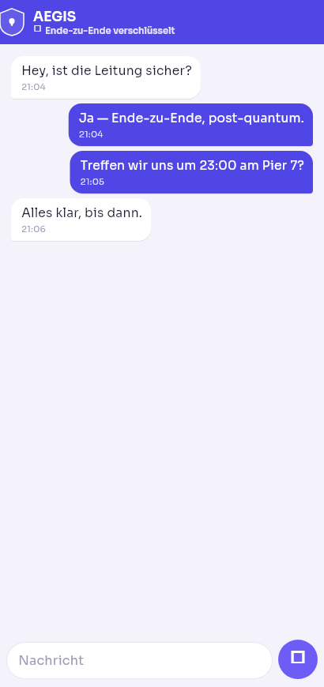
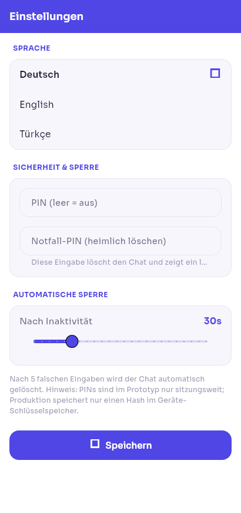
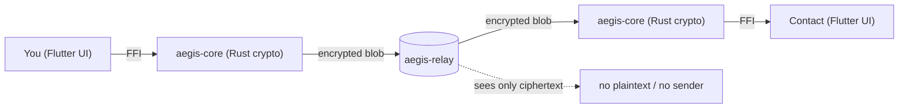

# AEGIS Messenger

### The post-quantum, end-to-end encrypted messenger — built so that *only you and your contact* can ever read a message.

> [!WARNING]
> **AEGIS is a working prototype that has *not yet* had an independent crypto audit.** Everything below is real and tested, and the limits are stated honestly. Do not rely on it for genuine high-risk communication until an external audit is complete.

---

## Why AEGIS exists

Most messengers protect *today's* messages against *today's* computers. The day a large quantum computer arrives, harvested ciphertext from years ago can be decrypted retroactively ("harvest-now, decrypt-later").

**AEGIS is built for that day.** It is post-quantum on **both** axes — confidentiality *and* authenticity — and engineered so that **no server, no operator, and no man-in-the-middle can ever read your chats.** Even on a seized phone, it is designed to give up nothing.

## See it

| Chat | Settings |
|:---:|:---:|
|  |  |

## How it fits together

All cryptography lives in a **Rust core** (`aegis-core`); the Flutter app calls it over FFI. The **relay** only moves opaque, encrypted blobs — it never sees plaintext, and with sealed-sender it does not even learn who sent a message.

## 🔐 Cryptography we use

AEGIS does **not** invent primitives. It composes audited building blocks (RustCrypto / dalek) into the Signal-style protocol, and validates the composition against official test vectors.

| Purpose | Primitive | Standard |
|---|---|---|
| Wire AEAD | **ChaCha20-Poly1305** | RFC 8439 |
| At-rest AEAD | **XChaCha20-Poly1305** (192-bit nonce) | RFC 8439 / draft-irtf |
| Post-quantum KEM | **ML-KEM-1024** | FIPS 203 |
| Post-quantum signature | **ML-DSA-65** | FIPS 204 |
| Post-quantum signature (hash-based) | **SLH-DSA-SHAKE-128f** | FIPS 205 |
| Classical key agreement | **X25519** | RFC 7748 |
| Classical signature | **Ed25519** | RFC 8032 |
| Hashing | **SHA-256/512, SHA-3 / SHAKE** | FIPS 180-4 / 202 |
| Key derivation | **HKDF** | RFC 5869 |
| Key hygiene | **zeroize-on-drop** (keys wiped from memory) | — |

**Handshake — PQXDH:** a Signal X3DH secret **‖** an ML-KEM-1024 shared secret, merged via HKDF. Secure as long as *either* the classical *or* the post-quantum assumption holds.

**Ratchet — continuous post-quantum:** every Double-Ratchet DH step mixes in a **fresh** ML-KEM-1024 secret → forward secrecy *and* post-compromise (self-healing) security, even against a quantum adversary.

**Identity — triple-hybrid signatures:** identity & pre-keys are signed with **Ed25519 ‖ ML-DSA-65 ‖ SLH-DSA** at once. Verification requires **all three** — forgery needs breaking classical *and* lattice *and* hash-based crypto simultaneously.

## 🧨 We attacked it ourselves — hard

Authorized adversarial testing against our own code and device. Highlights:

**Protocol attacks — all rejected:** identity-swap, ciphertext tamper, header tamper, replay, reorder-then-replay, forged signed-prekey, forged PQ-prekey, cross-session, malformed-wire, crafted-injection desync. *(11 protocol attacks + Google Wycheproof adversarial vectors.)*

**Fuzzing & DoS:** **250,000+** hostile/garbage inputs to the wire / envelope / relay parsers → **zero panics, zero overflows** (length-bounded, cap-before-allocation, memory-safe Rust).

**Live relay pentest (against the running server):**
| Attack | Result |
|---|---|
| Malformed opcode | connection closed, relay alive |
| 4 GiB length-prefix (OOM attempt) | rejected **before** allocation |
| Drain someone else's mailbox with a forged signature (BOLA) | **0 bytes delivered** |
| Truncated frames | no crash |
| 1024-message flood per mailbox | bounded (excess dropped) |
| 1100 concurrent connections | relay survived |

**Device pentest:** non-debuggable release (`run-as` blocked) · no exported components · malicious-intent fuzz → no crash · 2000 monkey events → no ANR · no plaintext in logcat · **no hardcoded secrets** in the native library.

**Standards audit:** mapped to **OWASP MASVS**; **MobSF** static scan (0 trackers, 0 secrets); **StrongBox** hardware key-backing confirmed on a real device; minSDK raised to the StrongBox API floor.

**Result:** the only real finding was a *LOW* clipboard-plaintext issue — **fixed**. No cryptographic weakness found.

## 👻 Device & "amnesic" security

- **End-to-end only** — keys never leave the two phones; the relay carries opaque blobs.
- **Amnesic by design** — chats live in **RAM only** (no chat database on disk); media bytes stay in memory and temp files are securely shredded; keys are zeroized on drop; optional **wipe-everything-on-leave**.
- **Duress PIN** — entering it covertly wipes everything and shows an empty decoy account.
- **FLAG_SECURE** — screenshots, screen-recording, and the app-switcher preview are blocked.
- **Hardware-backed keys** — Android **StrongBox** (→ TEE fallback), biometric/PIN app-lock + auto-lock, no cloud backup.

## 💬 Features

Multiple chats & profiles · **photos & voice messages** (each AEAD-sealed) · emoji reactions · replies/quotes · in-chat search · disappearing messages · safety-number verification · **DE / EN / TR**.

## ✅ Verified, honestly

- **Crypto core:** **81** Rust tests green — RFC/FIPS KATs, Wycheproof, property tests, 250k+ fuzz, relay DoS.
- **App:** **28** Flutter widget/unit tests green; built & run on a real device.
- **Guaranteed:** E2E confidentiality + integrity, forward secrecy, post-compromise security, replay/MITM protection, quantum resistance on both axes.
- **Best-effort / out of scope:** rooted/forensically-attacked devices · metadata vs. a network observer without a mixnet · **independent crypto audit + bug bounty (planned, not yet done)** · iOS.

## 🛠️ Tech stack

**Rust** (crypto core + relay) · **Flutter** + `flutter_rust_bridge` (Android) · RustCrypto / dalek primitives · FIPS 203/204/205 PQC.

## 📈 Status & roadmap

Working prototype (Android + Linux desktop). **Next:** independent crypto audit · encrypted persistence · media-over-relay transport · iOS · formal verification (Tamarin / ProVerif).

## 📜 License & commercial use

AEGIS is **proprietary software — © 2026 Ozan Küsmez. All rights reserved.**
You may **view and evaluate** it. **Running, deploying, or any commercial use requires a paid license.**
To license, deploy, or build on AEGIS → **ozanks20@gmail.com** · see [`LICENSE`](LICENSE).

---

Built by <b>Ozan Küsmez</b> · ozanks20@gmail.com · #cryptography #post-quantum #e2ee #secure-messaging #rust #flutter

