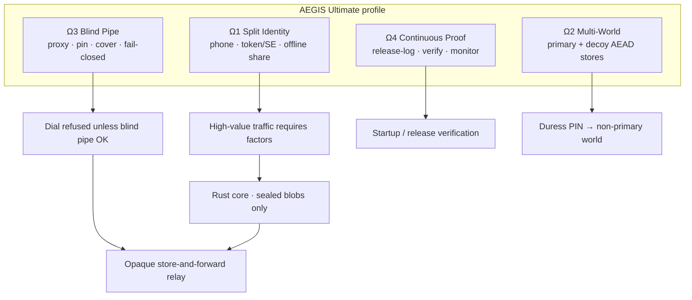
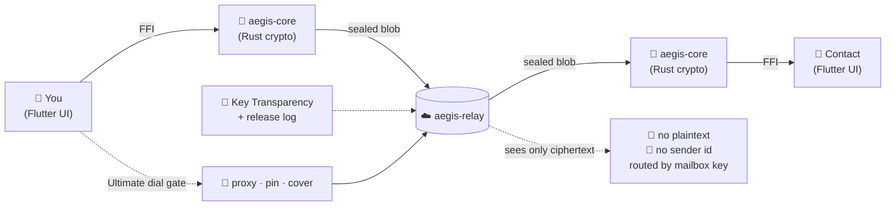

# AEGIS Messenger

### The post‑quantum, end‑to‑end encrypted messenger — engineered so that *only you and your contact* can ever read a message.

**Ultimate client policy (Ω1–Ω4) · Phases 0–5 · audit freeze package ready · August 2026**

> [!WARNING]
> **AEGIS is a working prototype that has *not yet* had an independent crypto audit.**  
> Everything below is real, tested, and — where it matters — *machine‑checked*. The limits are stated honestly.  
> **Do not rely on it for genuine high‑risk communication** until an external audit is complete.

> [!NOTE]
> **This repository is the public showcase** (README, license, UI assets).  
> Full source, CI, and engineering history live in the private development tree.  
> Evaluation and commercial licensing: **ozanks20@gmail.com** · see [`LICENSE`](LICENSE).

---

## ✨ Why AEGIS exists

Most messengers protect *today’s* messages against *today’s* computers. The day a large quantum computer arrives, ciphertext harvested years ago can be decrypted retroactively — the **"harvest‑now, decrypt‑later"** attack.

**AEGIS is built for that day.** It is post‑quantum on **both** axes — *confidentiality* **and** *authenticity* — and engineered so that **no server, no operator, and no man‑in‑the‑middle can ever read your chats.** Even on a seized phone, Ultimate mode is designed to give up **neither** the full account **nor** a proof that no further world exists.

What makes it different from “yet another secure messenger”:

| | Capability |
|:---:|:---|
| 🔭 | **Post‑quantum on both axes** — most products (incl. today’s Signal) are PQ for *confidentiality* only. AEGIS signs identities with **three** disjoint signature schemes too. *(Honest caveat: the signature axis is the least quantum‑urgent one — see [Where AEGIS honestly stands](#-where-aegis-honestly-stands-august-2026).)* |
| 🧮 | **Math‑first, machine‑checked** — handshake secrecy / authentication / no‑replay in **ProVerif**; ratchet forward secrecy in **Tamarin**; PQ **KEM‑combiner** symbolically *and* **computationally in CryptoVerif** — with anti‑vacuity controls that *must* fail. |
| 🧬 | **A second, non‑lattice confidentiality axis (HQC‑256)** — code‑based KEM as a *disjoint* second PQ leg, combined so confidentiality can survive a **total lattice break**. NIST/PQClean KAT‑pinned; opt‑in feature flag. |
| 🌳 | **Key Transparency + client self‑audit** — every served key committed into a **signed, append‑only Merkle directory**. Swapped keys fail proofs; directory key is **pinned**; client monitors its own view for fork / rollback / silent re‑key. |
| 🧅 | **Tor, mixnet & cover traffic** — Orbot *or* embedded Tor · optional **Nym** mixnet · Poisson cover · mailbox rotation. Ultimate **hard‑requires** the blind pipe (no clear TCP). |
| 🏗️ | **Reproducible builds + binary transparency** — bit‑identical relay rebuilds; release hashes in a signed append‑only log; **monitor** emits **ForkProof** on equivocation. |
| 🛡️ | **AEGIS Ultimate (Ω1–Ω4)** — Split Identity · Multi‑World Memory · Blind Pipe · Continuous Proof — **Phases 0–5 client policy shipped**. |
| 🙈 | **Amnesic & anti‑forensic** — RAM‑default chats, duress world, panic paths, gaze‑lock, screenshot block, hardware‑backed keys. |
| 🚫 | **No invented crypto** — RustCrypto / dalek · formally verified ML‑KEM family (`libcrux`) · PQClean HQC · FIPS/RFC/ACVP/Wycheproof + 250k+ fuzz. |

---

## 🛡️ AEGIS Ultimate — the four Ω

> **One‑line definition:** a realistic adversary (relay, network, quantum harvest, supply chain, theft of *one* device, coercion with *one* shown world) gets **neither** the full account **nor** a proof that no further world exists — and every claimed success is either **publicly refutable** or ends **fail‑closed**.

Ultimate is not a marketing sticker. It is four **mandatory** user promises.

| Ω | User promise (plain language) | Engineering name | Status |
|:---:|:---|:---|:---:|
| **Ω1** | *Even with my phone in the enemy’s hand, the account is not fully dead and not fully readable.* | **Split Identity** | ✅ shipped |
| **Ω2** | *Under coercion I can show a world, and nobody can prove it is the only one.* | **Multi‑World Memory** | ✅ shipped |
| **Ω3** | *The state / relay should not even see that I talk or with whom.* | **Blind Infrastructure** | ✅ shipped |
| **Ω4** | *The world can prove it — not take my word.* | **Continuous Proof** | ✅ shipped |

### Build phases (client policy)

| Phase | Focus | Ω | What shipped |
|:---:|:---|:---:|:---|
| **0** | Living Ultimate specification | all | Architecture + acceptance criteria |
| **1** | Proof spine + Ultimate profile skeleton | Ω4 | Profile flag · verify gate skeleton |
| **2** | **Blind Pipe** — fail‑closed dial | Ω3 | No clear TCP · proxy + pin + cover required · mailbox rotate every **5** msgs |
| **3** | **Split Identity** — 2‑of‑3 send authority | Ω1 | Shamir wrap key **W** · sealed identity **I** · discovery **AETH** / mailbox seed **AEMS** · SE token when HW |
| **4** | **Multi‑World** — duress selects decoy | Ω2 | Dual AEAD world stores · primary/decoy · Ultimate auto‑enrolls multi‑world |
| **5** | **Continuous Proof** + audit freeze | Ω4 | Release‑log monitor / ForkProof · client gate · CDN publish/validate scripts · freeze tag **`audit-freeze-2026-08-07`** |

```mermaid
flowchart TB
    subgraph Ultimate["AEGIS Ultimate profile"]
        U1["Ω1 Split Identity<br/>phone · token/SE · offline share"]
        U2["Ω2 Multi-World<br/>primary + decoy AEAD stores"]
        U3["Ω3 Blind Pipe<br/>proxy · pin · cover · fail-closed"]
        U4["Ω4 Continuous Proof<br/>release-log · verify · monitor"]
    end
    U1 --> Gate["High-value traffic requires factors"]
    U3 --> Dial["Dial refused unless blind pipe OK"]
    U4 --> Proof["Startup / release verification"]
    U2 --> Duress["Duress PIN → non-primary world"]
    Gate --> Core["Rust core · sealed blobs only"]
    Dial --> Relay["Opaque store-and-forward relay"]
    Core --> Relay
```

### What each Ω means for the user

| Ω | In plain language | Under the hood (short) |
|:---:|:---|:---|
| **Ω1** | Phone alone is incomplete | Identity sealed under wrap key **W**; **W** is Shamir 2‑of‑3 (phone · token/SE · offline). Discovery at rest uses threshold markers (**AETH** / **AEMS**), not a monodevice AEAD alone. |
| **Ω2** | Coercion can be met with a *shown* world | ≥ 2 sealed worlds; duress unlocks a **non‑primary** world; distinct per‑world AEAD keys; Ultimate auto‑enrolls multi‑world. |
| **Ω3** | Direct “phone → relay TCP” is not allowed in Ultimate | Fail‑closed if proxy / pin / cover policy not met; faster mailbox rotation; no delivery receipts on the relay path. |
| **Ω4** | Don’t take our word for the binary | Signed append‑only release log · client verify gate · monitor emits **ForkProof** · audit freeze package for external firms. |

### Hard residual ends (software cannot close these)

| ID | Residual | Why it remains |
|:---|:---|:---|
| **R‑A6** | Full malware / rooted OS reading app RAM while unlocked | Cleartext must exist somewhere to be read |
| **R‑A5∞** | Total coercion of human + all factors + all worlds + all shares | Human, not crypto |
| **R‑A10** | Flash forensics after crypto‑erase | Crypto‑erase ≠ physical media wipe |
| **R‑GLOBAL** | Global passive observer **without** mix‑class transport | Timing / volume correlation |

**Process residuals:** hosted public release‑log CDN · external firm contract & signed report · SE soft on desktop · full protocol‑epoch fan‑out revoke.

---

## 📱 See it

| Chat | Settings |
|:---:|:---:|
|  |  |

| Contact code | Two devices |
|:---:|:---:|
|  |   |

Android emulator + **Maestro** full UI suite last run **green** (smoke · settings · gaze · advanced TLS · save · new‑chat · devices).

---

## 🧩 How it fits together

```mermaid
flowchart LR
    You["📱 You<br/>(Flutter UI)"] -->|FFI| Core1["🦀 aegis-core<br/>(Rust crypto)"]
    Core1 -->|"sealed blob"| Relay[("☁️ aegis-relay")]
    Relay -->|"sealed blob"| Core2["🦀 aegis-core<br/>(Rust crypto)"]
    Core2 -->|FFI| Peer["📱 Contact<br/>(Flutter UI)"]
    Relay -.->|"sees only ciphertext"| Note["🚫 no plaintext<br/>🚫 no sender id<br/>routed by mailbox key"]
    KT["🌳 Key Transparency<br/>+ release log"] -.-> Relay
    You -.->|"Ultimate dial gate"| Pipe["🧅 proxy · pin · cover"]
    Pipe --> Relay
```

All cryptography lives in a **Rust core** (`#![forbid(unsafe_code)]` on the crypto crate); the Flutter app calls it over FFI. The **relay** only moves opaque encrypted blobs — it never sees plaintext, and it routes by an opaque recipient **mailbox key** (no sender field on the wire). Payload‑level **Sealed Sender** wraps the initial handshake *and* every ratchet message, so the relay sees **neither** the sender identity **nor** the cleartext ratchet header. The sealed‑sender / metadata layer is itself **PQ‑hybrid** (X25519 ∥ ML‑KEM‑1024) with per‑message forward secrecy.

| Component | Role |
|:---|:---|
| **aegis-core** | Protocol crypto (PQXDH, continuous PQ ratchet, triple‑hybrid signatures, sealed sender) |
| **aegis-relay** | Dumb store‑and‑forward — sealed blobs only |
| **aegis-kt** | Key Transparency directory + release‑log helpers |
| **aegis-memlock** | Best‑effort `mlock` for secrets |
| **aegis-groups** | MLS groups (crate present; app wiring evolves) |
| **Flutter app** | UI · Ultimate profile · discovery · multi‑world · FFI bridge |

> **Honest limit (metadata):** sealed‑sender‑*class* designs are academically known to be statistically deanonymizable by a malicious server over a conversation (Martiny, Kaptchuk, Aviv, Roche & Wustrow, NDSS 2021). AEGIS narrows that surface — **no delivery receipts on the relay path**, opt‑in **Tor** (Orbot or embedded), opt‑in **Nym**, **cover traffic**, **mailbox rotation**, and Ultimate **hard‑requires** the blind pipe. Full unlinkability against a determined relay or a *global* observer still depends on mix‑class transport end‑to‑end — **defense‑in‑depth, not a guarantee** (residual **R‑GLOBAL**).

---

## 🔐 Cryptography

AEGIS does **not** invent primitives. It composes audited building blocks (RustCrypto / dalek) plus a **formally‑verified ML‑KEM** family (`libcrux`) and the vetted **PQClean HQC** reference into a Signal‑style protocol, and validates the composition against official test vectors.

| Purpose | Primitive | Standard |
|:---|:---|:---|
| Wire AEAD | **ChaCha20‑Poly1305** | RFC 8439 |
| At‑rest AEAD (key‑committing) | **XChaCha20‑Poly1305** (192‑bit nonce) | RFC 8439 / draft‑irtf |
| Post‑quantum KEM (lattice) | **ML‑KEM‑1024** *(libcrux — formally verified family)* | FIPS 203 |
| Post‑quantum KEM (code‑based, disjoint) | **HQC‑256** *(PQClean reference, NIST L5; opt‑in)* | NIST PQC / 2025 selection |
| Post‑quantum signature (lattice) | **ML‑DSA‑87** *(NIST L5 / CNSA 2.0)* | FIPS 204 |
| Post‑quantum signature (hash‑based) | **SLH‑DSA‑SHAKE‑128f** | FIPS 205 |
| Classical key agreement | **X25519** | RFC 7748 |
| Classical signature | **Ed25519** | RFC 8032 |
| At‑rest PIN KDF | **Argon2id** (m=64 MiB, t=3, p=4) | RFC 9106 |
| Hashing | **SHA‑256/512, SHA‑3 / SHAKE** | FIPS 180‑4 / 202 |
| Key derivation | **HKDF** | RFC 5869 |
| Threshold share | **Shamir secret sharing** (2‑of‑3 wrap key **W**) | Ultimate Ω1 |
| Key hygiene | **zeroize‑on‑drop** + best‑effort `mlock` | — |

**🤝 Handshake — PQXDH:** a Signal X3DH secret **‖** an ML‑KEM‑1024 shared secret, merged via HKDF. The session root stays secret as long as *either* the classical *or* the post‑quantum assumption holds.

**🔄 Ratchet — continuous post‑quantum:** every Double‑Ratchet DH step mixes in a **fresh** ML‑KEM‑1024 secret → forward secrecy *and* post‑compromise (self‑healing) security, even against a quantum adversary. Same *continuous*‑PQ cadence class as Signal’s 2025 Triple Ratchet and Apple PQ3 — quantum resistance for the whole conversation, not just the handshake.

**🪪 Identity — triple‑hybrid signatures:** identity & pre‑keys are signed with **Ed25519 ‖ ML‑DSA‑87 ‖ SLH‑DSA** at once. Verification requires **all three** — forgery needs breaking classical *and* lattice *and* hash‑based crypto simultaneously.

**🧬 Crypto‑agility + a non‑lattice second axis (`SUITE_V3`):** versioned suite registry. `SUITE_V2` (X25519 ∥ ML‑KEM‑1024) is the shipped default; **`SUITE_V3` = X25519 ∥ ML‑KEM‑1024 ∥ HQC‑256** is wired end‑to‑end behind an opt‑in feature. Two PQ legs rest on **disjoint hard problems** (module‑lattice vs. syndrome decoding of quasi‑cyclic codes), composed as a **robust KEM‑combiner** (Giacon–Heuer–Poettering, PKC 2018). HQC is validated bit‑exact against the **official NIST/PQClean KAT**. *Default build stays SUITE_V2, pure‑Rust and byte‑identical.*

**🛡️ Downgrade resistance:** negotiated suite id and advertised capability lists are **bound into the transcript / root** on the v3 path. Remaining bundle‑strip vector is closed by an **EDHOC SUITES_I “always‑send‑I”** style mechanism (opt‑in `strict_downgrade`) — strip *or* truncation makes the two sides derive divergent roots (fail‑closed). Mutation‑proven.

**🔐 Ultimate at rest:** Shamir **2‑of‑3** wrap of the long‑term identity material · dual AEAD world stores · SE wrap of token/world keys when hardware is available.

---

## 🧮 Formally verified (machine‑checked)

The headline differentiator. AEGIS’s protocol composition is modelled in **ProVerif** (symbolic), **Tamarin** (ratchet), and **CryptoVerif** (computational). Security goals are *proven*, not just asserted. Symbolic models run as a **reproducible regression gate** that diffs every query outcome against a committed golden.

| Model | Tool | Property | Result |
|:---|:---|:---|:---:|
| PQXDH M1 | ProVerif | **Root‑key secrecy** + **hybrid**: root secret if X25519 **or** ML‑KEM holds | ✅ **TRUE** |
| PQXDH M1b | ProVerif | **Handshake authentication** — responder‑auth via signed prekey | ✅ **TRUE** |
| PQXDH M1c | ProVerif | **One‑time‑prekey single‑use ⇒ injective (no replay)** + falsification control | ✅ **TRUE** |
| PQXDH M1d | ProVerif | **Signed OPK dispensing ⇒ agreement** (relay/MITM cannot substitute an OPK) + control | ✅ **TRUE** |
| PQXDH M2 HQC | ProVerif | **ML‑KEM ∥ HQC combiner secrecy** even if the **whole lattice family falls** + control | ✅ **TRUE** |
| Combiner CV | **CryptoVerif** | **Combiner secrecy, computational** — root indistinguishable from random up to the honest HQC leg’s IND‑CCA2 advantage + non‑vacuity control | ✅ **PROVED** |
| DR FS | Tamarin | **Double‑Ratchet forward secrecy** (one‑way chain, bounded) | ✅ **VERIFIED** |

Modelled in the academic state of the art (Bhargavan–Jacomme–Kiefer–Schmidt, *PQXDH*, USENIX Security 2024; Cohn‑Gordon et al., *Signal*, EuroS&P 2017; Giacon–Heuer–Poettering, *KEM Combiners*, PKC 2018). The CryptoVerif combiner bound depends **only** on the HQC leg — proving the robust‑combiner theorem in the computational model; its **non‑vacuity control** (both KEM secrets leaked → root *not* provable) *must* flip, so the proof cannot be vacuous.

Symbolic proofs hold under idealized primitives. Residual: full computational handshake, unbounded PCS — tracked honestly on the formal roadmap.

---

## 🧨 We attacked it ourselves — hard

Authorized adversarial testing against our own code and device:

**Protocol attacks — all rejected:** identity‑swap · ciphertext tamper · header tamper · replay · reorder‑then‑replay · forged signed‑prekey · forged PQ‑prekey · cross‑session · malformed‑wire · crafted‑injection desync · suite‑downgrade (message‑rewrite *and* bundle‑strip) · Google Wycheproof adversarial vectors.

**Fuzzing & DoS:** **250,000+** hostile/garbage inputs to the wire / envelope / relay parsers → **zero panics, zero overflows** (length‑bounded, cap‑before‑allocation, memory‑safe Rust). HQC encapsulation path separately hammered with **200,000+** adversarial public keys → **0 panics**.

**Live relay pentest (against the running server):**

| Attack | Result |
|:---|:---|
| Malformed opcode | connection closed, relay alive |
| 4 GiB length‑prefix (OOM attempt) | rejected **before** allocation |
| Drain someone else’s mailbox with a forged signature (BOLA) | **0 bytes delivered** |
| 1024‑message flood per mailbox | bounded (excess dropped) |
| 1100 concurrent connections | relay survived (cap 1024 + idle timeout) |

**Device pentest:** non‑debuggable release · no exported components · malicious‑intent fuzz → no crash · 2000 monkey events → no ANR · no plaintext in logcat · **no hardcoded secrets** in the native library.

**Standards audit:** mapped to **OWASP MASVS** · **MobSF** static scan (0 trackers, 0 secrets) · **StrongBox** hardware key‑backing confirmed on a real device.

**Recursive self‑audit loop (4 cycles):** an adversarial *read → audit → fix → re‑audit* loop found and fixed **28 issues** (1 P0 · 2 P1 · 9 P2 · 16 P3) — and the re‑audit even **caught 2 regressions in its own earlier fixes**. The two most serious were both in anti‑forensic machinery: a **P0** — duress/lockout wipe was a **no‑op while the app was locked** — and a **P1** — duress wipe could **flush one buffered plaintext frame** before aborting. Both fixed and regression‑tested.

**`@username` discovery hardening:** closed **5 findings** + **11 tests** (bounded buffer + FIFO eviction · reorder strand · mailbox‑rotate abuse · dual‑poller race · wipe TOCTOU).

> **Result:** **no cryptographic weakness found** in these campaigns — no protocol break and no broken primitive. Every finding above was an implementation bug in the surrounding machinery — **all fixed and regression‑tested.**  
> **This is not a substitute for an independent external audit.**

---

## 👻 Device & “amnesic” security

- 🔒 **End‑to‑end only** — keys never leave the two phones; the relay carries opaque blobs.
- 🧠 **Amnesic by design** — chats live in **RAM only** by default (no chat database on disk); media bytes stay in memory; temp files securely shredded; keys zeroized on drop; optional wipe‑on‑leave. Encrypted persistence is strictly **opt‑in**.
- 🆘 **Duress PIN** — under multi‑world, unlocks a **decoy world**; otherwise legacy wipe / empty decoy account path.
- 👁️ **Gaze‑lock** — the app locks the instant the front camera stops seeing your face. Frames are processed **on‑device** and never stored or sent. *(Convenience feature — there is no published security research validating gaze‑based locking; do not treat it as a proven control.)*
- 📵 **FLAG_SECURE** — screenshots, screen‑recording, and the app‑switcher preview are blocked.
- 🔑 **Hardware‑backed keys** — Android **StrongBox** (→ TEE fallback), biometric/PIN app‑lock + auto‑lock, no cloud backup.
- 🧩 **Ultimate profile** — one Settings posture that hardens dial policy, traffic gates, multi‑world enrollment, and continuous‑proof checks together.

---

## 🪪 Find a contact by name — without a server address book

Pasting a 44‑character key is the surest way to lose a non‑technical user. AEGIS lets you add a contact by typing **`@username`** or tapping a **share‑link** — **no phone number, no email, no contact upload** — without giving up the security model:

- 🌳 **KT‑verified resolution.** A username resolves through the **same pinned Key‑Transparency directory** as every other key. The claim is **Ed25519‑signed under the mailbox** and **first‑claim‑wins**, so the relay cannot forge or repoint a name; the client checks signed **inclusion *and* absence** proofs.
- 🕸️ **The relay learns the minimum.** With an opt‑in **discovery mailbox**, the relay sees only that *a name exists and is being polled* — **not the conversation graph**. Discovery is opt‑in; the default stays amnesic.
- 🔀 **Then it disappears.** After the first handshake both sides **migrate off the shared discovery mailbox onto ephemeral per‑contact mailboxes**, and **sealed sender** hides who initiated.
- 🔐 **Threshold‑aware at rest (Ultimate Ω1).** When split identity is enrolled, discovery identity uses **AETH** markers and the mailbox seed is sealed as **AEMS** under wrap key **W** — phone alone does not hold a complete monodevice discovery identity blob.
- ✋ **First contact is authenticated** by a **safety‑number dialog**.

> **Honest limit:** a username is a **discovery** handle, *not* an identity proof — the **safety number is what authenticates**. Whoever looks a name up *first* trusts‑on‑first‑use; a first‑lookup squat is an unresolvable residual, the same TOFU caveat every such system has. The flow has been **proven live across two real phones**, with a known‑plaintext confidentiality check on the wire (`tcpdump` of the relay port: thousands of packets, **0 plaintext matches**).

---

## 💬 Features

| Area | Capabilities |
|:---|:---|
| **Messaging** | Multiple chats & profiles · photos & voice (each AEAD‑sealed, **chunked** over the relay) · emoji reactions · replies/quotes · in‑chat search · disappearing messages |
| **Identity** | Safety‑number verification · account re‑key · paper / Shamir backup · multi‑device link path |
| **Discovery** | `@username` or share‑link · no 44‑char paste required · KT‑backed claims · ephemeral mailbox migration after first handshake |
| **Transparency** | KT check on contact add (warning on swapped key) · client self‑audit · gossip entry points · release‑log verify / monitor |
| **Transport** | Tor (Orbot *or* embedded) · Nym‑mixnet transport · always‑on cover traffic · mailbox‑queue rotation · dual‑pin TLS (advanced) |
| **Ultimate** | Split identity (2‑of‑3) · multi‑world / duress world · blind‑pipe fail‑closed dial · continuous proof gate |
| **Locales** | **DE · EN · TR** |
| **Default posture** | Amnesic (opt‑in encrypted persistence) |

---

## ✅ Verified, honestly

All of the following are **vendor self‑reports** until an external audit exists.

| Layer | What we run / ran |
|:---|:---|
| 🦀 **Rust** | Workspace tests across `aegis-core` · `aegis-relay` · `aegis-kt` · `aegis-memlock` — RFC/FIPS KATs (incl. cross‑impl ML‑KEM), Wycheproof, adversarial unit tests, protocol hardening, suite registry, 250k+ fuzz. Feature builds: `hqc`, `tls`, `strict_downgrade`. |
| 📱 **Flutter** | Large widget/unit suite (Ultimate profile · threshold identity · multi‑world · continuous proof · discovery · Tor precedence · backup) — built & run on emulator and real devices. |
| 🎬 **Maestro UI** | Full suite green on Android emulator (`aegis_api34`): smoke · settings · gaze · advanced TLS · save · new‑chat sheet · devices. |
| 📡 **Live 2‑device** | `@name` chat on real hardware; wire capture showed relay carries ciphertext only. |
| 🧮 **Formal** | 7 machine‑checked models + anti‑vacuity controls (table above). |
| 🏷️ **Audit freeze** | Tag **`audit-freeze-2026-08-07`** packages the reviewable Ultimate client surface for external engagement. |

**Guaranteed by design intent (self‑reported):** E2E confidentiality + integrity · forward secrecy · post‑compromise security · replay/MITM protection · quantum resistance on both axes (with optional *disjoint* non‑lattice confidentiality backup) · relay accountability on served keys (KT + client self‑audit) · bit‑identical rebuild path for the relay artifact · Ultimate fail‑closed dial and high‑value traffic gates when the profile is on.

**⚠️ Best‑effort / out of scope:** rooted/forensically attacked devices (**R‑A6**) · a *global* network observer without mix‑class transport (**R‑GLOBAL**) · public third‑party KT monitors not yet universally hosted · **independent crypto audit + bug bounty (planned, not yet done)** · iOS product polish · a production multi‑region hosted relay as default SaaS.

---

## 🧭 Where AEGIS honestly stands (August 2026)

Per‑axis position against the shipping field, cross‑checked against this product surface and public state of the art — **Signal’s Sparse PQ Ratchet (SPQR / “Triple Ratchet”)** and **Apple iMessage PQ3**. Verdicts are deliberately conservative: where a shipping competitor matches or beats us, we say so.

| Axis | Position |
|:---|:---|
| PQ **identity** authentication (triple‑hybrid incl. hash‑based SLH‑DSA hedge) | **Ahead — genuinely rare.** No major production messenger ships PQ signatures on identity today. Honest caveat: this is the *least* quantum‑urgent axis (forgery needs a quantum computer *at signing time*; harvest‑now‑decrypt‑later does not apply to signatures). |
| PQ **confidentiality** + continuous PQ ratchet | **At parity, not ahead** for the ML‑KEM ratchet class (Signal SPQR / Apple PQ3). A **disjoint second axis (code‑based HQC‑256)** is wired behind a flag — that *specific* “survive a total lattice break” hedge is unusual. |
| **Crypto‑agility, downgrade resistance & non‑lattice hedge** | **Unusual.** Versioned suite registry + optional strict downgrade. Caveat: both advanced paths are opt‑in; shipped default is ML‑KEM‑only on the confidentiality axis. |
| Key Transparency with client self‑audit | **Ahead of most** consumer messengers. Gossip / third‑party monitors still an operator residual. |
| Formal proof maturity | **Mixed‑strong.** Symbolic (ProVerif/Tamarin) + computational CryptoVerif combiner; unbounded PCS + full CV handshake still roadmap. |
| **Ultimate client posture (Ω1–Ω4)** | **Shipped as client policy** (Phases 0–5). Not “physics‑impossible to coerce” — residuals R‑A6 / R‑A5∞ / R‑A10 / R‑GLOBAL are **explicit**. |
| Independent audit | **Behind every named competitor** — they are independently audited; AEGIS is not yet. Until then, treat all claims as vendor self‑reports. |
| Metadata in production | **Behind by‑construction designs** (SimpleX / Briar class) unless Ultimate + mix‑class path is enabled end‑to‑end. |
| Product breadth (groups, multi‑device, iOS, SaaS relay) | **Still closing.** Android prototype + Linux desktop path; groups crate / multi‑device path exist; iOS & global hosted defaults open. |

---

## 🛠️ Tech stack

**Rust** (crypto core + relay, `forbid(unsafe_code)` on core) · **Flutter** + `flutter_rust_bridge` (Android) · **ML Kit** on‑device face detection (gaze‑lock) · RustCrypto / dalek primitives · `libcrux` ML‑KEM · PQClean HQC · FIPS 203/204/205 PQC · Maestro for UI regression · signed release log for binary transparency.

---

## 📈 Status & roadmap

| Track | Status |
|:---|:---|
| Working prototype (Android + Linux desktop) | ✅ |
| Handshake & continuous PQ ratchet formally modelled | ✅ |
| Media over relay · `@username` discovery · KT + self‑audit | ✅ |
| Tor / embedded Tor · Nym path · cover · mailbox rotation | ✅ |
| Reproducible relay builds + release log + monitor | ✅ |
| Protocol v2 hardening (key‑committing AEAD, signed OPK pools, combiners) | ✅ |
| Suite registry + HQC second axis (opt‑in) | ✅ |
| **Ultimate Phases 0–5 client policy (Ω1–Ω4)** | ✅ |
| Audit freeze tag `audit-freeze-2026-08-07` | ✅ |
| Hosted public release‑log CDN | ⏳ operator residual |
| Independent crypto audit + bug bounty | ⏳ planned |
| Metadata to full strength by default (mixnet both ends, background cover) | ⏳ hardening |
| Unbounded PCS + full CryptoVerif handshake | ⏳ formal roadmap |
| Groups productization · multi‑device polish · iOS · SaaS relay | ⏳ product roadmap |

---

## 📜 License & commercial use

AEGIS is **proprietary software — © 2026 Ozan Küsmez. All rights reserved.**

| You may | You may **not** (without a paid license) |
|:---|:---|
| View this showcase repository | Run or deploy in production / commercially |
| Evaluate for personal, non‑commercial study | Provide AEGIS as a product or service to others |
| Contact the owner for a commercial license | Copy, redistribute, sublicense, or sell the software or derivatives |

**In short:** it belongs to the Owner. You may look. Anyone who wants to **run** or **use** it beyond private evaluation needs a **paid commercial license**.

**To license, deploy, or build on AEGIS → [ozanks20@gmail.com](mailto:ozanks20@gmail.com)** · full terms in [`LICENSE`](LICENSE).

**NO WARRANTY.** The Software is provided “AS IS”. It is an **UNAUDITED** prototype and must not be relied upon for real high‑risk communication until an independent security audit has been completed.

---

**AEGIS** — post‑quantum · end‑to‑end · Ultimate Ω1–Ω4

Built by <b>Ozan Küsmez</b> · [ozanks20@gmail.com](mailto:ozanks20@gmail.com)

<code>#cryptography #post-quantum #e2ee #secure-messaging #rust #flutter #key-transparency #formal-methods</code>

