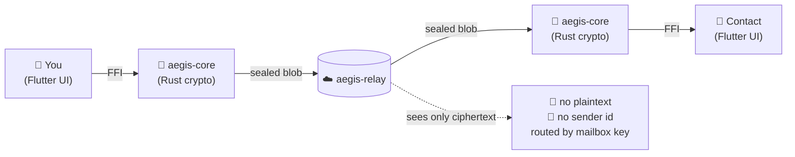

# AEGIS Messenger

### The post‑quantum, end‑to‑end encrypted messenger — engineered so that *only you and your contact* can ever read a message.

> [!WARNING]
> **AEGIS is a working prototype that has *not yet* had an independent crypto audit.** Everything below is real, tested, and — where it matters — *machine‑checked*. The limits are stated honestly. Do not rely on it for genuine high‑risk communication until an external audit is complete.

---

## ✨ Why AEGIS exists

Most messengers protect *today's* messages against *today's* computers. The day a large quantum computer arrives, ciphertext harvested years ago can be decrypted retroactively — the **"harvest‑now, decrypt‑later"** attack.

**AEGIS is built for that day.** It is post‑quantum on **both** axes — *confidentiality* **and** *authenticity* — and engineered so that **no server, no operator, and no man‑in‑the‑middle can ever read your chats.** Even on a seized phone, it is designed to give up nothing.

What makes it different from "yet another secure messenger":

- 🔭 **Post‑quantum on both axes** — most products (incl. today's Signal) are PQ for *confidentiality* only. AEGIS signs identities with **three** disjoint signature schemes too. *(Honest caveat: the signature axis is the least quantum‑urgent one — see [Where AEGIS honestly stands](#-where-aegis-honestly-stands-june-2026).)*
- 🧮 **Math‑first, machine‑checked** — the handshake's secrecy, authentication and no‑replay properties are **formally verified in ProVerif**; the ratchet's forward secrecy in **Tamarin**; and the post‑quantum **KEM‑combiner** (the "two disjoint KEMs" guarantee) both symbolically *and* **computationally in CryptoVerif** — with anti‑vacuity controls that *must* fail.
- 🧬 **A second, non‑lattice confidentiality axis (HQC‑256).** Beyond ML‑KEM, AEGIS wires a **code‑based** KEM (HQC‑256, NIST's 2025 backup pick) as a *disjoint* second post‑quantum leg, combined so confidentiality survives **even a total break of the entire lattice family**. It is validated bit‑exact against the **official NIST/PQClean KAT** and is opt‑in behind a feature flag (default‑off to keep the reproducible build pure‑Rust).
- 🌳 **Key Transparency + client self‑audit** — every key the relay serves is committed into a **signed, append‑only Merkle directory** (CONIKS/CT model). A swapped key fails the proof; the directory key is **pinned persistently**; and the client **monitors its own view over time** — a relay that forks, rolls back, or silently re‑keys its directory between observations is caught, across restarts.
- 🧅 **Tor, mixnet & cover traffic (opt‑in)** — route every relay connection through Tor — an external **Orbot** *or* an in‑process **embedded Tor** that needs no Orbot — so the relay never sees your IP (`.onion` supported); optionally tunnel through the **Nym mixnet** (Sphinx packets reordered by independent mix nodes — the only one of these that resists a *global* observer); hide *when* you type behind an always‑on Poisson stream of decoys (Loopix); and **rotate mailbox queues** so the relay can't follow one address across a session.
- 🏗️ **Reproducible builds + binary transparency** — the relay rebuilds **bit‑identical** in a digest‑pinned, self‑verifying container; release hashes go into a signed append‑only log. A backdoored binary is either absent from the log or public evidence.
- 🙈 **Amnesic & anti‑forensic** — RAM‑only chats, duress PIN, panic‑burn, gaze‑lock, screenshot block, hardware‑backed keys.
- 🛡️ **No invented crypto** — audited classical primitives (RustCrypto / dalek) plus a **formally‑verified ML‑KEM** (`libcrux`, the implementation family Signal ships) and the vetted **PQClean** HQC reference, all validated against official FIPS/RFC/ACVP/NIST‑KAT vectors + Google Wycheproof + 250k fuzz.

## 📱 See it

| Chat | Settings |
|:---:|:---:|
|  |  |

## 🧩 How it fits together

```mermaid
flowchart LR
    You["📱 You<br/>(Flutter UI)"] -->|FFI| Core1["🦀 aegis-core<br/>(Rust crypto)"]
    Core1 -->|"sealed blob"| Relay[("☁️ aegis-relay")]
    Relay -->|"sealed blob"| Core2["🦀 aegis-core<br/>(Rust crypto)"]
    Core2 -->|FFI| Peer["📱 Contact<br/>(Flutter UI)"]
    Relay -.->|"sees only ciphertext"| Note["🚫 no plaintext<br/>🚫 no sender id<br/>routed by mailbox key"]
```

All cryptography lives in a **Rust core** (`aegis-core`, `#![forbid(unsafe_code)]`); the Flutter app calls it over FFI. The **relay** only moves opaque, encrypted blobs — it never sees plaintext, and it routes by an opaque recipient **mailbox key** (no sender field on the wire). Payload‑level **Sealed Sender** is wired into the app send path: the initial handshake *and* every ratchet message are wrapped in a sealed‑sender envelope, so the relay sees **neither** the sender identity **nor** the cleartext ratchet header. The sealed‑sender / metadata layer is itself **PQ‑hybrid** (X25519 ∥ ML‑KEM‑1024) with per‑message forward secrecy — so even metadata resists harvest‑now‑decrypt‑later. See [`docs/THREAT_MODEL.md`](docs/THREAT_MODEL.md).

> **Honest limit:** sealed‑sender‑*class* designs are academically known to be statistically deanonymizable by a malicious server over a conversation (Martiny, Kaptchuk, Aviv, Roche & Wustrow, NDSS 2021). AEGIS narrows that attack surface — there are **no delivery receipts on the relay path** (the NDSS attack's main amplifier), and opt‑in **Tor (external Orbot or embedded)**, an opt‑in **Nym‑mixnet transport**, **always‑on cover traffic** and **mailbox‑queue rotation** raise the bar further. Full unlinkability against a determined relay or a *global* observer still depends on those opt‑in transports being enabled end‑to‑end — the mixnet in particular needs a running Nym client and both endpoints over it — so AEGIS treats metadata privacy as **defense‑in‑depth, not a guarantee**.

---

## 🔐 Cryptography

AEGIS does **not** invent primitives. It composes audited building blocks (RustCrypto / dalek) plus a **formally‑verified ML‑KEM** (`libcrux`) and the vetted **PQClean HQC** reference into the Signal‑style protocol, and validates the composition against official test vectors.

| Purpose | Primitive | Standard |
|---|---|---|
| Wire AEAD | **ChaCha20‑Poly1305** | RFC 8439 |
| At‑rest AEAD (key‑committing) | **XChaCha20‑Poly1305** (192‑bit nonce) | RFC 8439 / draft‑irtf |
| Post‑quantum KEM (lattice) | **ML‑KEM‑1024** *(libcrux — formally verified, hax/F\*)* | FIPS 203 |
| Post‑quantum KEM (code‑based, disjoint) | **HQC‑256** *(PQClean reference, NIST L5; opt‑in `hqc` feature)* | NIST PQC round 4 / 2025 selection |
| Post‑quantum signature (lattice) | **ML‑DSA‑87** *(NIST L5 / CNSA 2.0)* | FIPS 204 |
| Post‑quantum signature (hash‑based) | **SLH‑DSA‑SHAKE‑128f** | FIPS 205 |
| Classical key agreement | **X25519** | RFC 7748 |
| Classical signature | **Ed25519** | RFC 8032 |
| At‑rest PIN KDF | **Argon2id** (m=64 MiB, t=3, p=4) | RFC 9106 |
| Hashing | **SHA‑256/512, SHA‑3 / SHAKE** | FIPS 180‑4 / 202 |
| Key derivation | **HKDF** | RFC 5869 |
| Key hygiene | **zeroize‑on‑drop** + best‑effort `mlock` | — |

**🤝 Handshake — PQXDH:** a Signal X3DH secret **‖** an ML‑KEM‑1024 shared secret, merged via HKDF. The session root stays secret as long as *either* the classical *or* the post‑quantum assumption holds.

**🔄 Ratchet — continuous post‑quantum:** every Double‑Ratchet DH step mixes in a **fresh** ML‑KEM‑1024 secret → forward secrecy *and* post‑compromise (self‑healing) security, even against a quantum adversary. This is the same *continuous*‑PQ cadence Signal shipped in its 2025 Triple Ratchet and Apple in PQ3 — quantum resistance for the whole conversation, not just the handshake.

**🪪 Identity — triple‑hybrid signatures:** identity & pre‑keys are signed with **Ed25519 ‖ ML‑DSA‑87 ‖ SLH‑DSA** at once. Verification requires **all three** — forgery needs breaking classical *and* lattice *and* hash‑based crypto simultaneously.

**🧬 Crypto‑agility + a non‑lattice second axis (`SUITE_V3`):** the root derivation and the bundle/initial wire are version‑negotiated through a **suite registry**. `SUITE_V2` (X25519 ∥ ML‑KEM‑1024) is the shipped default; **`SUITE_V3` = X25519 ∥ ML‑KEM‑1024 ∥ HQC‑256** is wired end‑to‑end (real encap/decap in the handshake) behind the opt‑in `hqc` feature. The two post‑quantum legs rest on **disjoint hard problems** (module‑lattice vs. syndrome decoding of quasi‑cyclic codes), composed as a **robust KEM‑combiner** (Giacon–Heuer–Poettering, PKC 2018): the root stays pseudorandom while **either** ML‑KEM **or** HQC holds — so confidentiality survives even a *total* break of the lattice family. The HQC leg is validated bit‑exact against the **official NIST/PQClean round‑4 KAT** (its `.rsp` sha256 reproduced equal to PQClean's pinned `META.yml` value) and its decapsulation is `catch_unwind`‑guarded against the HQC decode‑failure path. *Default build stays `[SUITE_V2]`, pure‑Rust and byte‑identical — HQC is not in the shipped APK unless the feature is enabled.*

**🛡️ Downgrade resistance:** the negotiated suite id and both advertised capability lists are **bound into the transcript / root** for the v3 path; a message‑level downgrade is rejected fail‑fast. The remaining bundle‑strip vector (a relay stripping the responder's unsigned advertised list) is closed by an **EDHOC SUITES_I "always‑send‑I"** mechanism — the initiator always carries its real capability list and it is **bound into the root**, so a strip *or* a truncation of that list makes the two sides derive divergent roots (fail‑closed). This is built and proven (see below) behind an opt‑in `strict_downgrade` feature; enabling it by default trades v2 wire byte‑compatibility (a deliberate owner decision). Grounded in RFC 8446 §4.1.3, RFC 9528 (EDHOC) and Bhargavan et al. 2016.

---

## 🧮 Formally verified (machine‑checked)

The headline differentiator. AEGIS's protocol composition is modelled in **ProVerif 2.05** (symbolic), **Tamarin 1.12** (ratchet), and **CryptoVerif 2.12** (computational), and the security goals are *proven*, not just asserted. Each model lives in [`docs/formal/`](docs/formal/) with its committed result, and the symbolic models run as a **reproducible regression gate** ([`scripts/run-proofs.sh`](scripts/run-proofs.sh) diffs every query outcome against a committed golden).

| Model | Tool | Property | Result |
|---|---|---|:---:|
| `pqxdh-m1.pv` | ProVerif | **Root‑key secrecy (G1)** + **hybrid (G6)**: root stays secret if X25519 **or** ML‑KEM holds | ✅ **TRUE** (3 worlds) |
| `pqxdh-m1b.pv` | ProVerif | **Handshake authentication (G2/G5)** — responder‑auth via signed prekey; implicit initiator‑auth | ✅ **TRUE** |
| `pqxdh-m1c.pv` | ProVerif | **One‑time‑prekey single‑use ⇒ injective (no replay)** + falsification control | ✅ **TRUE** (control ❌) |
| `pqxdh-m1d.pv` | ProVerif | **Signed one‑time‑prekey dispensing ⇒ agreement (relay/MITM cannot substitute an OPK)** + control | ✅ **TRUE** (control ❌) |
| `pqxdh-m2-hqc.pv` | ProVerif | **ML‑KEM ∥ HQC combiner secrecy** — root secret even if the **whole lattice family falls**, while the disjoint HQC leg holds + control | ✅ **TRUE** (control ❌) |
| `cv-pqxdh-m2-combiner.cv` | **CryptoVerif** | **Combiner secrecy, computational** — `root` indistinguishable from random up to the *single honest HQC leg's* IND‑CCA2 advantage, with the ML‑KEM secret key *handed to the adversary* + non‑vacuity control | ✅ **PROVED** (control unprovable) |
| `dr-m2-fs.spthy` | Tamarin | **Double‑Ratchet forward secrecy** (one‑way chain, bounded) | ✅ **VERIFIED** |

Modelled exactly as the academic state of the art (Bhargavan–Jacomme–Kiefer–Schmidt, *PQXDH*, USENIX Security 2024; Cohn‑Gordon et al., *Signal*, EuroS&P 2017; Giacon–Heuer–Poettering, *KEM Combiners*, PKC 2018). The CryptoVerif combiner bound depends **only** on the HQC leg — proving the robust‑combiner theorem in the computational model; its **non‑vacuity control** (both KEM secrets leaked → root *not* provable) is wired into the gate and *must* flip, so the proof cannot be vacuous. Symbolic proofs hold under idealized primitives; the residual (full computational handshake, unbounded PCS) is stated honestly in [`docs/FORMAL_VERIFICATION_PLAN.md`](docs/FORMAL_VERIFICATION_PLAN.md).

---

## 🧨 We attacked it ourselves — hard

Authorized adversarial testing against our own code and device:

**Protocol attacks — all rejected:** identity‑swap, ciphertext tamper, header tamper, replay, reorder‑then‑replay, forged signed‑prekey, forged PQ‑prekey, cross‑session, malformed‑wire, crafted‑injection desync, suite‑downgrade (message‑rewrite *and* bundle‑strip). *(Protocol attacks + Google Wycheproof adversarial vectors.)*

**Fuzzing & DoS:** **250,000+** hostile/garbage inputs to the wire / envelope / relay parsers → **zero panics, zero overflows** (length‑bounded, cap‑before‑allocation, memory‑safe Rust). The HQC encapsulation path was separately hammered with **200,078** adversarial public keys → **0 panics** (the unsigned, relay‑served HQC prekey cannot crash the initiator).

**Live relay pentest (against the running server):**

| Attack | Result |
|---|---|
| Malformed opcode | connection closed, relay alive |
| 4 GiB length‑prefix (OOM attempt) | rejected **before** allocation |
| Drain someone else's mailbox with a forged signature (BOLA) | **0 bytes delivered** |
| 1024‑message flood per mailbox | bounded (excess dropped) |
| 1100 concurrent connections | relay survived (cap 1024 + idle timeout) |

**Device pentest:** non‑debuggable release · no exported components · malicious‑intent fuzz → no crash · 2000 monkey events → no ANR · no plaintext in logcat · **no hardcoded secrets** in the native library.

**Standards audit:** mapped to **OWASP MASVS**; **MobSF** static scan (0 trackers, 0 secrets); **StrongBox** hardware key‑backing confirmed on a real device.

**Recursive self‑audit loop (4 cycles):** an adversarial *read → audit → fix → re‑audit* loop run against our own code found and fixed **28 issues** (1 P0 · 2 P1 · 9 P2 · 16 P3) — and the re‑audit even **caught 2 regressions in its own earlier fixes** — before converging clean. The two most serious were both in the anti‑forensic machinery: a **P0** — the duress/lockout wipe was a **no‑op while the app was locked** — and a **P1** — the duress wipe could **flush one buffered plaintext frame** before aborting. Both fixed and regression‑tested. A later honesty‑audit pass corrected a *documentation* over‑statement (a v3‑live claim that overstated downgrade coverage) — and that residual is now the closed‑behind‑a‑flag `strict_downgrade` mechanism above.

**`@username` discovery hardening:** an adversarial pass on the new contact‑by‑name path closed **5 findings** + added **11 tests** (unbounded inbound growth → bounded buffer + FIFO eviction · reorder strand · mailbox‑rotate abuse · dual‑poller race · wipe TOCTOU).

> **Result:** **no cryptographic weakness found** — no protocol break and no broken primitive. Every finding above was an implementation bug in the surrounding machinery — **all fixed and regression‑tested.**

---

## 👻 Device & "amnesic" security

- 🔒 **End‑to‑end only** — keys never leave the two phones; the relay carries opaque blobs.
- 🧠 **Amnesic by design** — chats live in **RAM only** (no chat database on disk); media bytes stay in memory and temp files are securely shredded; keys are zeroized on drop; optional **wipe‑everything‑on‑leave**. (Encrypted persistence is strictly **opt‑in**.)
- 🆘 **Duress PIN** — entering it covertly wipes everything and shows an empty decoy account.
- 👁️ **Gaze‑lock** — the app locks the instant the front camera stops seeing your face. Frames are processed **on‑device** and never stored or sent. *(Convenience feature — there is no published security research validating gaze‑based locking; do not treat it as a proven control.)*
- 📵 **FLAG_SECURE** — screenshots, screen‑recording, and the app‑switcher preview are blocked.
- 🔑 **Hardware‑backed keys** — Android **StrongBox** (→ TEE fallback), biometric/PIN app‑lock + auto‑lock, no cloud backup.

## 🪪 Find a contact by name — without a server address book

Pasting a 44‑character key is the surest way to lose a non‑technical user. AEGIS lets you add a contact by typing **`@username`** or tapping a **share‑link** — **no phone number, no email, no contact upload** — without giving up the security model:

- 🌳 **KT‑verified resolution.** A username resolves through the **same pinned Key‑Transparency directory** as every other key. The claim is **Ed25519‑signed under the mailbox** and **first‑claim‑wins**, so the relay cannot forge or repoint a name; the client checks signed **inclusion *and* absence** proofs. (Wire: relay opcodes `0x08` claim / `0x09` resolve; KT tags `0x22/0x23/0x24` — see [`docs/PROTOCOL_SPEC.md`](docs/PROTOCOL_SPEC.md).)
- 🕸️ **The relay learns the minimum.** With an opt‑in **discovery mailbox**, the relay sees only that *a name exists and is being polled* — **not the conversation graph**. Discovery is opt‑in; the default stays amnesic.
- 🔀 **Then it disappears.** After the first handshake both sides **migrate off the shared discovery mailbox onto ephemeral per‑contact mailboxes**, and **sealed sender** hides who initiated — so the durable handle is used once, not for every message.
- ✋ **First contact is authenticated** by a **safety‑number dialog**.

> **Honest limit:** a username is a **discovery** handle, *not* an identity proof — the **safety number is what authenticates**. Whoever looks a name up *first* trusts‑on‑first‑use; a first‑lookup squat is an unresolvable residual, the same TOFU caveat every such system has. The whole flow is **proven live across two real phones** (see *Verified, honestly* below).

---

## 💬 Features

Multiple chats & profiles · **add a contact by `@username` or a share‑link** — no 44‑char code to copy/paste, no phone number (opt‑in discovery mailbox: the relay learns only that a name exists & is polled, *not* who talks to whom; after the first handshake both sides migrate to ephemeral per‑contact mailboxes, and a safety‑number dialog authenticates the first contact) · **photos & voice messages** (each AEAD‑sealed, **chunked over the relay** so large media works) · emoji reactions · replies/quotes · in‑chat search · disappearing messages · safety‑number verification · **key‑transparency check on contact add** (warning dialog on a swapped key) · **Tor routing (Orbot *or* embedded), Nym‑mixnet transport, always‑on cover traffic & mailbox‑queue rotation** (opt‑in, configurable) · opt‑in encrypted persistence (default: amnesic) · smooth message‑entrance animations · **DE / EN / TR**.

---

## ✅ Verified, honestly

All Rust numbers below were **freshly re‑measured** (WSL toolchain, `cargo 1.95`, `--no-fail-fast`); every crate is green with 0 failures.

- **🦀 Rust — 243 workspace tests green** across four crates:
  - `aegis-core` **172** — RFC/FIPS KATs (incl. a cross‑impl libcrux≡RustCrypto≡NIST ML‑KEM KAT), Wycheproof vectors, adversarial unit tests, the protocol‑v2 hardening (key‑committing AEAD, domain‑separated combiner, signed‑Merkle OPK pools), the encrypted‑backup envelope, the **crypto‑agility suite registry**, and 250k+ fuzz.
  - `aegis-relay` **40** (DoS / BOLA / flood / KT‑restart) · `aegis-kt` **28** (Merkle proofs, golden root, equivocation, rollback/fork monitor, tamper rejection) · `aegis-memlock` **3**.
  - **Opt‑in feature builds gate their own code so it cannot bit‑rot:** `aegis-core --features hqc` → **186** (**+14**: real HQC‑256 encap/decap, the ML‑KEM∥HQC combiner, the **external NIST/PQClean HQC KAT**, and the full v3 handshake over the wire) · `aegis-relay --features tls` → **42** (**+2**: rustls + cert‑pin transport) · `aegis-core --features hqc,strict_downgrade` → **186** (the EDHOC‑SUITES_I downgrade‑closure tests). All default‑OFF to keep the reproducible build pure‑Rust.
  - **Non‑vacuity is proven, not assumed:** the two downgrade‑closure tests were verified by **mutation** — disabling the always‑send‑I wire emit turns the bundle‑strip test **RED**; disabling the v2‑root binding turns the truncation test **RED**; restoring makes both **GREEN** again.
- **📱 Flutter — 164** widget/unit tests (last full run; the Dart/FFI bridge layer is under active parallel work) — incl. the `@username` discovery‑identity store + inbound‑mailbox hardening (bounded growth/FIFO eviction, all‑zero‑rotate rejection, wipe‑generation guard), the contact‑link / `aegis://` parser, the embedded‑Tor `effectiveProxy` precedence + fail‑closed invariant, and the encrypted‑backup round‑trip; built & run on real devices.
- **📡 Live 2‑device `@name` chat — proven end‑to‑end on real hardware** (Xiaomi `@ozantest1` ↔ Samsung): typing a username resolves it under the pinned KT directory, handshakes, and migrates to ephemeral mailboxes. Confidentiality was checked on the wire — a known plaintext was sent + received while a `tcpdump` capture of the relay port recorded **1 418 packets / ~24 KB relayed with 0 plaintext matches** (exact / case‑insensitive / token / strings) — the relay carries ciphertext only.
- **🧮 Formal — 7 machine‑checked models** (5 ProVerif + 1 CryptoVerif + 1 Tamarin) **+ 4 falsification/anti‑vacuity controls** (3 ProVerif + 1 CryptoVerif) — see table above. The 8 ProVerif models + the Tamarin model run reproducibly as a regression gate (`PROOFS OK (8 ProVerif + 1 Tamarin)`); the CryptoVerif combiner proof + its non‑vacuity control are gated alongside (`CRYPTOVERIF OK`).
- **🔒 Guaranteed:** E2E confidentiality + integrity, forward secrecy, post‑compromise security, replay/MITM protection, quantum resistance on both axes (with a *disjoint* non‑lattice confidentiality backup once `hqc` is enabled), relay accountability on served keys (KT + client self‑audit for fork/rollback/re‑key), bit‑identical rebuilds of the relay artifact.
- **⚠️ Best‑effort / out of scope:** rooted/forensically‑attacked devices · a *global* network observer (the opt‑in Nym‑mixnet transport is runtime‑gated — needs a running Nym client + both endpoints over it) · KT gossip/third‑party monitors not yet deployed · **independent crypto audit + bug bounty (planned, not yet done)** · groups (a foundational `aegis-groups` crate exists with its own 12 tests, but group messaging is **not** wired into the app) · multi‑device · iOS · a production‑hosted relay (current testing uses a local relay).

## 🧭 Where AEGIS honestly stands (June 2026)

Per‑axis position against the shipping field, cross‑checked **June 2026** against this codebase and against the public state of the art — **Signal's Sparse PQ Ratchet (SPQR / "Triple Ratchet")** announced **Oct 2025** and **Apple iMessage PQ3** (periodic PQ rekeying). The verdicts below are deliberately conservative: where a shipping competitor matches or beats us, we say so.

| Axis | Position |
|---|---|
| PQ **identity** authentication (triple‑hybrid incl. hash‑based SLH‑DSA hedge) | **Ahead — genuinely unique.** No production messenger ships PQ signatures on identity today. Honest caveat: this is the *least* quantum‑urgent axis (forgery needs a quantum computer *at signing time*; harvest‑now‑decrypt‑later does not apply to signatures). |
| PQ **confidentiality** + continuous PQ ratchet | **At parity, not ahead** for the ML‑KEM ratchet (Signal SPQR/Triple Ratchet, Apple PQ3 ship the same class — with computational proofs and better ratchet bandwidth). **A disjoint second axis (code‑based HQC‑256) is wired** behind a flag — that *specific* "survive a total lattice break" hedge is unusual in shipping messengers. |
| **Crypto‑agility, downgrade resistance & non‑lattice hedge** | **Unusual.** A versioned suite registry negotiates ML‑KEM vs. ML‑KEM ∥ HQC‑256 with the suite ids + both advertised capability lists **bound into the transcript**; an opt‑in EDHOC‑SUITES_I "always‑send‑I" path closes the bundle‑strip downgrade with a root binding that *also* defeats list‑truncation (proven by mutation). Few shipping messengers expose a *disjoint code‑based* PQ fallback **or** a binding‑based downgrade defence at this granularity. Honest caveat: both are opt‑in (default‑off) until the v2‑deprecation decision, so the shipped build is ML‑KEM‑only on the confidentiality axis. |
| Key Transparency with client self‑audit | **Ahead of most** (WhatsApp‑class; SimpleX/Briar don't have it). Gossip/third‑party monitors still missing. |
| Formal proof maturity | **Mixed.** Symbolic (ProVerif/Tamarin) + a **computational CryptoVerif combiner proof**; forward secrecy still bounded. PQ3 has Tamarin over unbounded loops *plus* a full computational handshake proof. Roadmap: unbounded + full CryptoVerif handshake ([`docs/PARITY_PLAN.md`](docs/PARITY_PLAN.md) Phase 3). |
| Independent audit | **Behind every named competitor** — they are all independently audited; AEGIS is not yet. Until then, treat all claims as vendor self‑reports. |
| Metadata in production | **Behind SimpleX/Briar** (no‑identifier design / Tor‑P2P by construction). AEGIS: sealed‑sender class (known weak per NDSS 2021) + opt‑in Tor (external/embedded), opt‑in Nym‑mixnet transport, always‑on cover & mailbox‑queue rotation, no receipts on the relay path — but these are opt‑in/runtime‑gated, not by‑construction. |
| Product breadth (groups, multi‑device, iOS, backup) | **Behind.** 1:1 Android only today — closing this is [`docs/PARITY_PLAN.md`](docs/PARITY_PLAN.md) Phase 4. |

The full gap‑closing roadmap lives in [`docs/PARITY_PLAN.md`](docs/PARITY_PLAN.md).

## 🛠️ Tech stack

**Rust** (crypto core + relay, `forbid(unsafe_code)`) · **Flutter** + `flutter_rust_bridge` (Android) · **ML Kit** on‑device face detection (gaze‑lock) · RustCrypto / dalek primitives · `libcrux` ML‑KEM · PQClean HQC · FIPS 203/204/205 PQC. Builds run under **WSL2** — see [`BUILD.md`](BUILD.md) and [`docs/adr/`](docs/adr/).

## 📈 Status & roadmap

Working prototype (Android + Linux desktop): handshake & ratchet **formally verified**, media‑over‑relay, **contact‑by‑`@username` discovery** (opt‑in mailbox, live‑proven across two real phones), **key transparency + client self‑audit**, **Tor (Orbot or embedded) + Nym‑mixnet transport + always‑on cover + mailbox‑queue rotation**, **reproducible builds + binary transparency**, and **offline delivery** (background mailbox drain + unread badges) shipping; ML‑KEM on a **formally‑verified** implementation.

**Protocol v2 hardening complete** (Phase 1): key‑committing transport AEAD · domain‑separated hybrid‑signature combiner · signed PQ one‑time prekeys (machine‑checked in ProVerif).

**Crypto‑agility + a second confidentiality axis — now wired (opt‑in):** a versioned **suite registry** with **`SUITE_V3` = X25519 ∥ ML‑KEM‑1024 ∥ HQC‑256** is live behind the default‑OFF `hqc` feature — real HQC‑256 encap/decap in the handshake, the ML‑KEM∥HQC combiner, **external NIST/PQClean KAT conformance**, and the full v3 handshake e2e over the wire, with the combiner secrecy proven symbolically (ProVerif) *and* computationally (CryptoVerif). The bundle‑strip downgrade residual is closed by the **EDHOC‑SUITES_I `strict_downgrade`** mechanism (built + mutation‑proven; default‑off because turning it on deprecates the v2 wire — an owner decision). The default shipped build stays `[SUITE_V2]`, pure‑Rust and byte‑identical.

**Next:** release keystore + SLSA/sigstore provenance · independent crypto audit + bug bounty · metadata/anonymity to full strength (mixnet path over *both* endpoints · on‑device runtime of the embedded‑Tor build · background cover while suspended) · a ProVerif model of the downgrade closure · unbounded‑PCS proof (Tamarin) + full CryptoVerif handshake · encrypted backup · group messaging (MLS/TreeKEM) · multi‑device · iOS · a production‑hosted relay + KT.

## 📜 License & commercial use

AEGIS is **proprietary software — © 2026 Ozan Küsmez. All rights reserved.**
You may **view and evaluate** it. **Running, deploying, or any commercial use requires a paid license.**
To license, deploy, or build on AEGIS → **ozanks20@gmail.com** · see [`LICENSE`](LICENSE).

---

Built by <b>Ozan Küsmez</b> · ozanks20@gmail.com · <code>#cryptography #post-quantum #e2ee #secure-messaging #rust #flutter</code>

