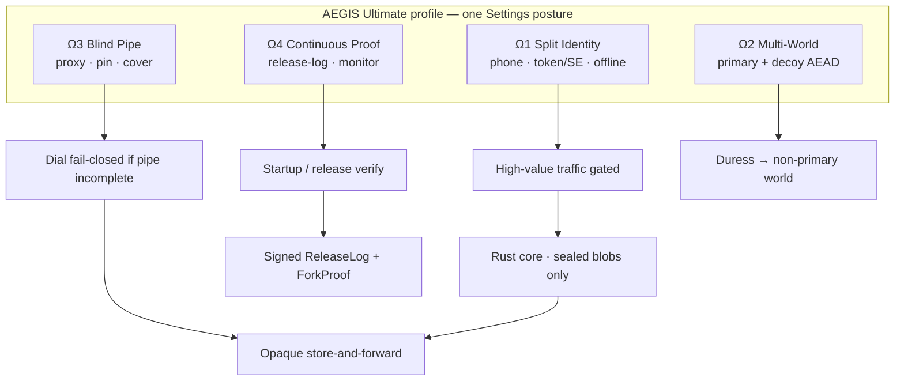
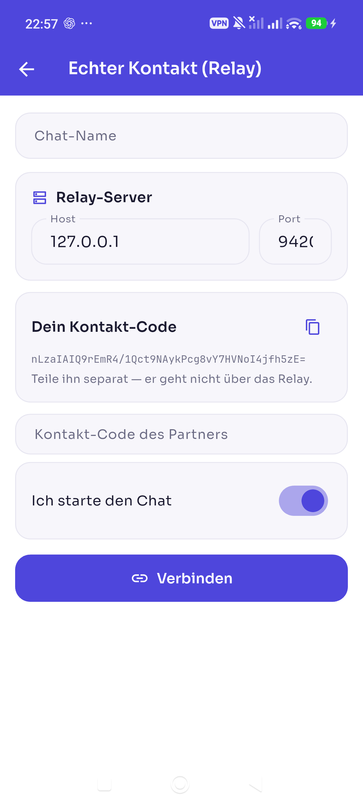
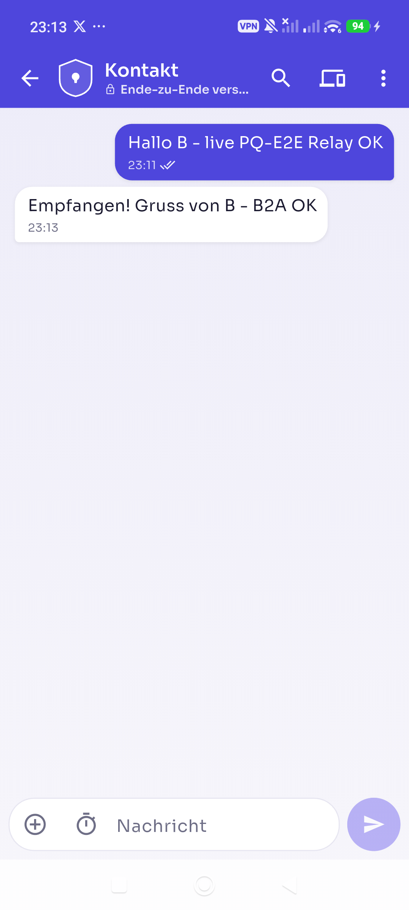
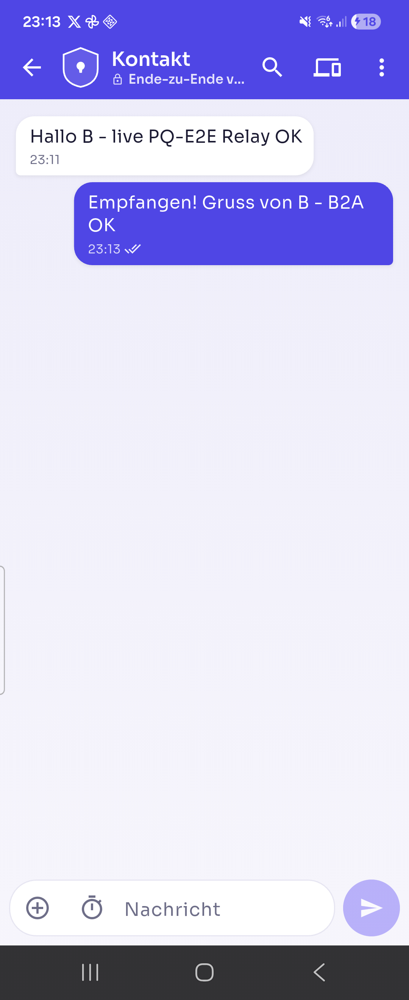
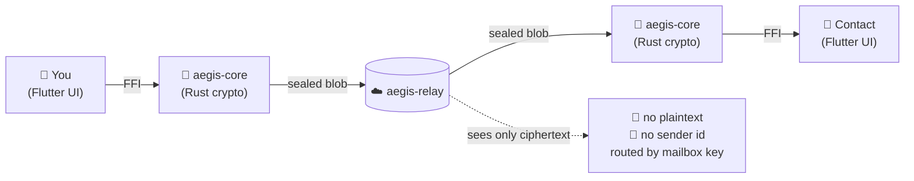

<div align="center">


# AEGIS Messenger

### The post‑quantum, end‑to‑end encrypted messenger — engineered so that *only you and your contact* can ever read a message.

**Ultimate client policy (Ω1–Ω4) · Phases 0–5 implemented in development · two internal audit rounds landed · August 2026**

<p>


</p>
<p>


</p>


</div>

> [!WARNING]
> **AEGIS is a working prototype that has *not yet* had an independent crypto audit.** Everything below is real, tested, and — where it matters — *machine‑checked*. The limits are stated honestly. **Do not rely on it for genuine high‑risk communication** until an external audit is complete.

> [!NOTE]
> **This public repository is the showcase surface** (this README, the license, UI assets). The engineering source is **not published here**; it lives in a private development tree. The project is licensed **Apache 2.0** — see [`LICENSE`](LICENSE). Evaluation, source access & commercial questions: **ozanks20@gmail.com**.

> [!CAUTION]
> **Release readiness — 2026-08-12: NOT launch-ready. There is no production release.** Release-readiness round **RR4B** is still closing local lifecycle and crash-consistency defects. The next round, **RR4C**, remains launch-blocked on Device Link: local secondary-state application must commit atomically, and the secondary must return an authenticated `apply-committed` acknowledgement with transaction-ID reconciliation. GitHub Actions is also billing-blocked: engineering PR run **31586620932** failed before any steps ran and produced no job logs. It is therefore **not evidence of a code failure or a green CI run**, and this README makes no CI-green claim.


---

## ✨ Why AEGIS exists

Most messengers protect *today's* messages against *today's* computers. The day a large quantum computer arrives, ciphertext harvested years ago can be decrypted retroactively — the **"harvest‑now, decrypt‑later"** attack.

**AEGIS is built for that day.** It is post‑quantum on **both** axes — *confidentiality* **and** *authenticity* — and engineered so that **no server, no operator, and no man‑in‑the‑middle can ever read your chats.** Even on a seized phone, **Ultimate** is designed so the adversary gets **neither** the full account **nor** a cryptographic proof that no further world exists — within the residual ends we name honestly (R‑A6, R‑A5∞, R‑A10, R‑GLOBAL).

What makes it different from "yet another secure messenger":

- 🔭 **Post‑quantum on both axes** — most products (incl. today's Signal) are PQ for *confidentiality* only. AEGIS signs identities with **three** disjoint signature schemes too. *(Honest caveat: the signature axis is the least quantum‑urgent one — see [Where AEGIS honestly stands](#-where-aegis-honestly-stands-august-2026).)*
- 🧮 **Math‑first, machine‑checked** — the handshake's secrecy, authentication and no‑replay properties are **formally verified in ProVerif**; the ratchet's forward secrecy in **Tamarin**; and the post‑quantum **KEM‑combiner** (the "two disjoint KEMs" guarantee) both symbolically *and* **computationally in CryptoVerif** — with anti‑vacuity controls that *must* fail.
- 🧬 **A second, non‑lattice confidentiality axis (HQC‑256).** Beyond ML‑KEM, AEGIS wires a **code‑based** KEM (HQC‑256, NIST's 2025 backup pick) as a *disjoint* second post‑quantum leg, combined so confidentiality survives **even a total break of the entire lattice family**. It is validated bit‑exact against the **official NIST/PQClean KAT** and is opt‑in behind a feature flag (default‑off to keep the reproducible build pure‑Rust).
- 🌳 **Key Transparency + client self‑audit** — every key the relay serves is committed into a **signed, append‑only Merkle directory** (CONIKS/CT model). A swapped key fails the proof; the directory key is **pinned persistently**; and the client **monitors its own view over time** — a relay that forks, rolls back, or silently re‑keys its directory between observations is caught, across restarts.
- 🧅 **Tor, mixnet & cover traffic (opt‑in)** — route every relay connection through Tor — an external **Orbot** *or* an in‑process **embedded Tor** that needs no Orbot — so the relay never sees your IP (`.onion` supported); optionally tunnel through the **Nym mixnet** (Sphinx packets reordered by independent mix nodes — the only one of these that resists a *global* observer); hide *when* you type behind an always‑on Poisson stream of decoys (Loopix); and **rotate mailbox queues** so the relay can't follow one address across a session. Decoys are padded into the same size buckets as real messages on **both** the 1:1 and the group path — until audit round 2 the production group path was unpadded, so a one‑byte decoy was distinguishable from a real message by envelope length alone, without any cryptanalysis. Fixed 2026‑08‑11.
- 🏗️ **Reproducible builds** — the relay rebuilds **bit‑identical** in a digest‑pinned, self‑verifying container, demonstrated by a full double build. The signed append‑only log that release hashes would go into is **built and tested but has never logged a real release**: binary transparency is *prepared*, not yet *in operation*. See [Verified, honestly](#-verified-honestly).
- 🙈 **Amnesic & anti‑forensic** — RAM‑only chats by default, duress PIN (and under Ultimate a **duress *world***), panic‑burn, gaze‑lock, screenshot block, hardware‑backed keys.
- 🛡️ **AEGIS Ultimate (Ω1–Ω4)** — Split Identity · Multi‑World Memory · Blind Pipe · Continuous Proof. **Phases 0–5 client policy is implemented** on the development mainline; see the full section below.
- 🚫 **No invented crypto** — audited classical primitives (RustCrypto / dalek) plus a **formally‑verified ML‑KEM** (`libcrux`, the implementation family Signal ships) and the vetted **PQClean** HQC reference, all validated against official FIPS/RFC/ACVP/NIST‑KAT vectors + Google Wycheproof + 250k+ fuzz.


---

## 🛡️ AEGIS Ultimate — four Ω that are not optional

Most "secure messengers" stop at content encryption. **Ultimate** is a harder product bar: the system is designed so that a realistic adversary — the relay, the network, a quantum harvest of ciphertext, a supply‑chain backdoor, **theft of one device**, or **coercion with one shown world** — gets **neither** the full account **nor** a proof that no further world exists. And every claimed success is either **publicly refutable** or ends **fail‑closed**.

That is not marketing language for "military grade." It is a single target architecture with four mandatory user promises. If any Ω is missing, the product is a prior grade (ASP / Hardened) — **not** Ultimate.

| Ω | User promise (plain language) | Engineering name | Client status |
|---|---|---|:---:|
| **Ω1** | *Even with my phone in the enemy's hand, the account is not fully dead and not fully readable.* | **Split Identity** | ✅ **implemented** |
| **Ω2** | *Under coercion I can show a world, and nobody can prove it is the only one.* | **Multi‑World Memory** | ✅ **implemented** |
| **Ω3** | *The state / relay should not even see that I talk or with whom.* | **Blind Infrastructure** | ✅ **implemented** |
| **Ω4** | *The world can prove it — not take my word.* | **Continuous Proof** | ✅ **implemented** |

### How Ultimate was built (Phases 0 → 5)

Ultimate was not a single PR. It was implemented as a **documented phase ladder** on the development mainline, each phase with an exit gate:

| Phase | Focus | Primary Ω | What actually landed |
|:---:|---|:---:|---|
| **0** | Living specification | all | Ultimate definition, adversary×promise matrix, residual ends R‑A6 / R‑A5∞ / R‑A10 / R‑GLOBAL |
| **1** | Proof spine + profile skeleton | **Ω4** | Ultimate Settings flag, continuous‑proof gate skeleton, release‑log hooks |
| **2** | **Blind Pipe** | **Ω3** | Ultimate **refuses clear TCP** to the relay. Dial is fail‑closed unless proxy (Tor/Nym‑class) + cover policy + pin requirements are met. Ephemeral receive mailboxes rotate every **5** real messages under Ultimate (far tighter than the default cadence). |
| **3** | **Split Identity** | **Ω1** | Long‑term provision secret **I** sealed under wrap key **W**. **W** is Shamir **2‑of‑3** (phone · token/SE · offline share). High‑value send **and** decrypt/poll require the split factors when enrolled. Discovery at rest no longer trusts a monodevice identity AEAD alone — it uses an **AETH** marker. The discovery mailbox seed is sealed under **W** as **AEMS**. When hardware is present, the token share is **SE‑wrapped**; revoke shreds that wrap for the enrollment. |
| **4** | **Multi‑World Memory** | **Ω2** | ≥ 2 sealed worlds at rest; only one unlocked per session. Duress PIN selects a **non‑primary** world when multi‑world is enrolled (else the legacy wipe path). Distinct per‑world AEAD keys + sealed primary/decoy snapshots. World keys SE‑wrapped when hardware allows. Enabling Ultimate **auto‑enrolls** multi‑world so the decoy path is not an expert‑only checkbox. |
| **5** | **Continuous Proof** + audit freeze | **Ω4** | Every release artifact can enter a signed append‑only **ReleaseLog**. A CLI **monitor** emits **ForkProof** on fork/rollback/equivocation. The client runs a startup / Ultimate proof gate (layout + release membership / `kt_verify_release`). Operator scripts publish and validate CDN layouts. Annotated tag **`audit-freeze-2026-08-07`** froze a reviewable surface for an external firm — **not** a completed audit. |


```mermaid
flowchart TB
    subgraph U["AEGIS Ultimate profile — one Settings posture"]
      O1["Ω1 Split Identity<br/>phone · token/SE · offline"]
      O2["Ω2 Multi-World<br/>primary + decoy AEAD"]
      O3["Ω3 Blind Pipe<br/>proxy · pin · cover"]
      O4["Ω4 Continuous Proof<br/>release-log · monitor"]
    end
    O1 --> HV["High-value traffic gated"]
    O3 --> DIAL["Dial fail-closed if pipe incomplete"]
    O4 --> PROOF["Startup / release verify"]
    O2 --> DURESS["Duress → non-primary world"]
    HV --> CORE["Rust core · sealed blobs only"]
    DIAL --> RELAY["Opaque store-and-forward"]
    CORE --> RELAY
    PROOF --> LOG["Signed ReleaseLog + ForkProof"]
```

### Ω1 — Split Identity (phone alone is incomplete)

Under Ultimate, **the phone is not the whole account**. The long‑term identity material **I** is sealed under a wrap key **W**. **W** itself is never stored as a single blob on one factor: it is split with **Shamir secret sharing (2‑of‑3)** across phone · hardware token / Secure Element · offline share. Sending and decrypting high‑value traffic while enrolled requires the live factors — a seized locked phone that only holds one share does not hand the adversary a complete monodevice identity.

Discovery was hardened the same way: at rest the client uses threshold‑aware markers (**AETH** for identity, **AEMS** for the mailbox seed under **W**) so "wipe the phone disk and read the discovery identity" is no longer a one‑device complete story.

**Device revocation — stated exactly, because the honest version is narrower than the obvious one.** Revoking a device has effect on the live path rather than only in the UI: the roster marks it revoked, and the message fan‑out filters to *currently active* devices **before** anything is encrypted or sent, so in the normal case a message is never addressed to the revoked device at all. An account re‑key is offered in the same step and is really wired.

What we do **not** claim — and this is the part most products would leave unsaid: enforcement is **sender‑side only**. Revocation is a local, signed roster change on the *other* devices; it is never transmitted to the relay, and never to the revoked device. The relay authenticates nothing on submit — anyone may drop a blob for any recipient id — so if a message does reach the revoked device's mailbox anyway (a sender with a stale roster, a non‑conforming client), it is **fully readable**: a local revoke rotates no session or ratchet keys, and a subsequent account re‑key governs *future* sessions, not messages already delivered. The relay‑side revoke opcode that does exist is **self‑de‑registration** of the account's own discovery bundle — revoking a *different*, lost or stolen device remotely is out of scope for it by design, and its own source comment says so.

So: there is no relay‑side and no key‑side backstop behind the sender‑side filter. A network‑wide protocol‑epoch fan‑out revoke remains an honest residual, and the end‑to‑end behaviour under a deliberately stale sender is on the list to be proven on real devices rather than argued from source.

### Ω2 — Multi‑World Memory (coercion meets a shown world)

Coercion is not solved by crypto — **total** coercion of a human with every factor and every world is residual **R‑A5∞**. What Ultimate *does* ship is the next best engineering bar: **at least two cryptographically sealed worlds**, only one unlocked per session, with **distinct AEAD keys** and sealed primary/decoy snapshots. Entering the duress PIN does **not** necessarily wipe everything into an empty decoy account — when multi‑world is enrolled it unlocks a **non‑primary world** that can look like a real (but limited) life.

> ### On‑disk deniability — the half that is easy to get wrong
>
> Sealing both worlds is the easy half. The hard half is that **the disk must not reveal that a second world exists at all** — otherwise a coerced user opens the decoy and the examiner simply keeps going. Our own audit (round 2, 2026‑08‑11) found **seven independent ways** to tell an enrolled installation from a never‑enrolled one, **none of which required decrypting anything**:
>
> speaking file names (`aegis_world_decoy_snap.bin`) · a plaintext marker byte heading every slot file · file size (a 4096‑byte history became a 4098‑byte file) · snapshots created only on first *entering* a world — for the duress world, often the moment of coercion itself · `mtime` frozen at install time for 4 of 5 files · the files existing **only** after enrolment, so their mere presence was the answer · and deleting them on wipe, which under that scheme would itself have announced the wipe.
>
> **All seven are closed.** Names carry no meaning; the marker and world index moved under the seal; every file is a fixed size, CSPRNG‑filled, with the length field inside the AEAD; **all files are created unconditionally at first launch for every installation**, enrolled or not; any write refreshes the others so timestamps move together; and wipe/disable now **overwrite with fresh cover under new keys instead of deleting**. Verified by a second reviewer whose only role was to play the forensic examiner and who could read production code but never change it — 26 tests, including whole‑file entropy, `ctime`/`mtime` divergence, wipe convergence and lossless migration.
>
> **Reading this repository must not help.** A first version masked the payload length with an XOR whose mask sat in the same file — enough against `ls` and a hex dump, useless against anyone who reads the source and un‑masks it. The plaintext is now padded to a fixed size **before** it is sealed: measured against real crypto, a 50 000‑byte world and an empty one both seal to exactly **200 072 bytes** (before the fix: 50 072 against 74).
>
> **One limit remains, stated rather than hidden:** a snapshot larger than the cap is stored at its true length, unpadded. Data integrity comes first — silently truncating real conversation history would be worse than the deniability gap it leaves in that one outlier case.
>
> **One rejected fix worth recording**, because it would have made things worse: equalising timestamps with `setLastModified` was proposed, then measured — it sets `mtime` and never touches `ctime`, leaving a months‑wide gap between the two. That is the textbook signature of deliberate timestamp tampering, which forensic tooling flags automatically. For a coerced user, *"you wiped your traces"* is a worse finding than *"you have a second world"* — it prolongs the coercion instead of ending it. Real rewrites move both stamps together, so that is what ships, and two tests stand guard against anyone switching to the cheaper approach later.

Ultimate auto‑enrolls multi‑world when the profile is turned on, so the feature is not buried behind expert toggles. Cover/traffic policy stays independent of which world is active.

### Ω3 — Blind Pipe (no “just TCP to the relay”)

Ultimate is not "Tor recommended." Ultimate is **fail‑closed**:

- no direct clear TCP to the relay;
- Tor and/or a Nym‑class path required;
- cover traffic policy on;
- TLS certificate pinning where configured;
- mailbox rotation on a **tight** cadence (every **5** real messages);
- still **no delivery receipts** on the relay path (the NDSS sealed‑sender traffic‑analysis amplifier).

If the pipe is incomplete, the dial **does not silently fall back to plain** — it refuses. That is the difference between a privacy checklist and a posture.

### Ω4 — Continuous Proof (don’t take our word for the binary)

Supply‑chain claims without public evidence are theater. Ultimate's proof spine:

- publish each release artifact into a signed, append‑only **ReleaseLog**;
- client gate checks layout / membership;
- operator **monitor** path emits **ForkProof** if the log forks or rolls back;
- CDN publish + layout validate scripts for operators who host the public log.

**Stated plainly:** the machinery is built and tested, but **no real release has ever been logged**, and **no verification anchor has been published** — so today there is nothing for a stranger to verify against. Build **reproducibility** is real and was re‑verified by a full double build; build **authenticity** is not, and cannot be until a release key is published. A publicly hosted log URL, a signed external audit report and a funded bug bounty are all still open. The social and operational half is not magic.

### Hard residual ends (the only accepted “losses”)

Ultimate **accepts** exactly these residual ends — marketing must never claim them closed:

| ID | Residual | Why software alone cannot "solve" it |
|----|----------|--------------------------------------|
| **R‑A6** | Full malware / rooted OS reading app RAM while the user is unlocked | Cleartext must exist somewhere to be *read* |
| **R‑A5∞** | Total coercion of the human + all factors + all worlds + all shares | Human, not crypto |
| **R‑A10** | Flash / FTL forensics after crypto‑erase | Crypto‑erase ≠ physical media wipe |
| **R‑GLOBAL** | Global passive observer **without** mix‑class transport | Timing and volume correlation |

---

## 📱 See it

| Chat | Settings |
|:---:|:---:|
|  |  |

| Contact / safety number | Two real devices |
|:---:|:---:|
|  | &nbsp; |

The UI is a **Flutter** Android client (Linux desktop path for development). A dated local **2026-08-11** snapshot exercised emulator smoke and the **Maestro** UI flows for launch · settings · gaze · advanced TLS · save · new-chat · devices on an `aegis_api34` AVD. Crypto and threshold logic stay on unit tests, not UI automation.

## 🧩 How it fits together


```mermaid
flowchart LR
    You["📱 You<br/>(Flutter UI)"] -->|FFI| Core1["🦀 aegis-core<br/>(Rust crypto)"]
    Core1 -->|"sealed blob"| Relay[("☁️ aegis-relay")]
    Relay -->|"sealed blob"| Core2["🦀 aegis-core<br/>(Rust crypto)"]
    Core2 -->|FFI| Peer["📱 Contact<br/>(Flutter UI)"]
    Relay -.->|"sees only ciphertext"| Note["🚫 no plaintext<br/>🚫 no sender id<br/>routed by mailbox key"]
```

The `aegis-core` and `aegis-kt` crates enforce `#![forbid(unsafe_code)]`. The relay and generated Flutter FFI boundary are tracked separately rather than being folded into a tree-wide claim. The reviewed bridge baseline contains **118 generated `unsafe` blocks, 0 handwritten `unsafe` blocks, and 20 generated `unsafe` attributes**. The **relay** only moves opaque, encrypted blobs — it never sees plaintext, and it routes by an opaque recipient **mailbox key** (no sender field on the wire). Payload‑level **Sealed Sender** is wired into the app send path: the initial handshake *and* every ratchet message are wrapped in a sealed‑sender envelope, so the relay sees **neither** the sender identity **nor** the cleartext ratchet header. The sealed‑sender / metadata layer is itself **PQ‑hybrid** (X25519 ∥ ML‑KEM‑1024) with per‑message forward secrecy — so even metadata resists harvest‑now‑decrypt‑later.

> **Honest limit:** sealed‑sender‑*class* designs are academically known to be statistically deanonymizable by a malicious server over a conversation (Martiny, Kaptchuk, Aviv, Roche & Wustrow, NDSS 2021). AEGIS narrows that attack surface — there are **no delivery receipts on the relay path** (the NDSS attack's main amplifier), and opt‑in **Tor (external Orbot or embedded)**, an opt‑in **Nym‑mixnet transport**, **always‑on cover traffic** and **mailbox‑queue rotation** raise the bar further. Full unlinkability against a determined relay or a *global* observer still depends on those opt‑in transports being enabled end‑to‑end — the mixnet in particular needs a running Nym client and both endpoints over it — so AEGIS treats metadata privacy as **defense‑in‑depth, not a guarantee**.

---

## 🔐 Cryptography

AEGIS does **not** invent primitives. It composes audited building blocks (RustCrypto / dalek) plus a **formally‑verified ML‑KEM** (`libcrux`) and the vetted **PQClean HQC** reference into the Signal‑style protocol, and validates the composition against official test vectors.

| Purpose | Primitive | Standard |
|---|---|---|
| Wire AEAD | **ChaCha20‑Poly1305** | RFC 8439 |
| At‑rest AEAD (key‑committing) | **XChaCha20‑Poly1305** (192‑bit nonce) | RFC 8439 / draft‑irtf |
| Post‑quantum KEM (lattice) | **ML‑KEM‑1024** *(libcrux — formally verified, hax/F\*)* | FIPS 203 |
| Post‑quantum KEM (code‑based, disjoint) | **HQC‑256** *(PQClean reference, NIST L5; opt‑in `hqc` feature)* | NIST PQC round 4 / 2025 selection |
| Post‑quantum signature (lattice) | **ML‑DSA‑87** *(NIST L5 / CNSA 2.0)* | FIPS 204 |
| Post‑quantum signature (hash‑based) | **SLH‑DSA‑SHAKE‑128f** | FIPS 205 |
| Classical key agreement | **X25519** | RFC 7748 |
| Classical signature | **Ed25519** | RFC 8032 |
| At‑rest PIN KDF | **Argon2id** (m=64 MiB, t=3, p=4) | RFC 9106 |
| Hashing | **SHA‑256/512, SHA‑3 / SHAKE** | FIPS 180‑4 / 202 |
| Key derivation | **HKDF** | RFC 5869 |
| Threshold wrap (Ultimate Ω1) | **Shamir secret sharing** 2‑of‑3 over wrap key **W** | Classical SSS + AEAD seal of **I** |
| World stores (Ultimate Ω2) | Per‑world **XChaCha20‑Poly1305** keys (SE‑wrapped when HW available) | At‑rest multi‑world |
| Key hygiene | **zeroize‑on‑drop** + best‑effort `mlock` | — |

**🤝 Handshake — PQXDH:** a Signal X3DH secret **‖** an ML‑KEM‑1024 shared secret, merged via HKDF. The session root stays secret as long as *either* the classical *or* the post‑quantum assumption holds.

**🔄 Ratchet — continuous post‑quantum:** every Double‑Ratchet DH step mixes in a **fresh** ML‑KEM‑1024 secret → forward secrecy *and* post‑compromise (self‑healing) security, even against a quantum adversary. This is the same *continuous*‑PQ cadence Signal shipped in its 2025 Triple Ratchet and Apple in PQ3 — quantum resistance for the whole conversation, not just the handshake.

**🪪 Identity — triple‑hybrid signatures:** identity & pre‑keys are signed with **Ed25519 ‖ ML‑DSA‑87 ‖ SLH‑DSA** at once. Verification requires **all three** — forgery needs breaking classical *and* lattice *and* hash‑based crypto simultaneously.

**🧬 Crypto‑agility + a non‑lattice second axis (`SUITE_V3`):** the root derivation and the bundle/initial wire are version‑negotiated through a **suite registry**. `SUITE_V2` (X25519 ∥ ML‑KEM‑1024) is the default development configuration; **`SUITE_V3` = X25519 ∥ ML‑KEM‑1024 ∥ HQC‑256** is wired end‑to‑end (real encap/decap in the handshake) behind the opt‑in `hqc` feature. The two post‑quantum legs rest on **disjoint hard problems** (module‑lattice vs. syndrome decoding of quasi‑cyclic codes), composed as a **robust KEM‑combiner** (Giacon–Heuer–Poettering, PKC 2018): the root stays pseudorandom while **either** ML‑KEM **or** HQC holds — so confidentiality survives even a *total* break of the lattice family. The HQC leg is validated bit‑exact against the **official NIST/PQClean round‑4 KAT** and its decapsulation is `catch_unwind`‑guarded against the HQC decode‑failure path. *Default builds stay `[SUITE_V2]`, pure‑Rust and byte‑identical; HQC is absent from APK build artifacts unless the feature is enabled.*

**🛡️ Downgrade resistance:** the negotiated suite id and both advertised capability lists are **bound into the transcript / root** for the v3 path; a message‑level downgrade is rejected fail‑fast. The remaining bundle‑strip vector (a relay stripping the responder's unsigned advertised list) is closed by an **EDHOC SUITES_I "always‑send‑I"** mechanism — the initiator always carries its real capability list and it is **bound into the root**, so a strip *or* a truncation of that list makes the two sides derive divergent roots (fail‑closed). This is built and proven (see below) behind an opt‑in `strict_downgrade` feature; enabling it by default trades v2 wire byte‑compatibility (a deliberate owner decision). Grounded in RFC 8446 §4.1.3, RFC 9528 (EDHOC) and Bhargavan et al. 2016.

**🔐 Ultimate at rest (Ω1 + Ω2):** content crypto is not enough if a single device disk holds a complete account. Under Ultimate the long‑term provision secret is sealed under wrap key **W**, and **W** is split 2‑of‑3. Discovery identity and mailbox seed follow the same threshold story (**AETH** / **AEMS**). Separately, multi‑world memory keeps **primary** and **decoy** sealed under distinct AEAD keys — duress unlocks a non‑primary world when enrolled. This is complementary to PQXDH/ratchet: those protect the *wire*; these protect *possession* and *coercion with one PIN*.

---

## 🧮 Formally verified (machine‑checked)

The headline differentiator. AEGIS's protocol composition is modelled in **ProVerif 2.05** (symbolic), **Tamarin 1.12** (ratchet), and **CryptoVerif 2.12** (computational), and the security goals are *proven*, not just asserted. Each model ships with its committed result, and the symbolic models run as a **reproducible regression gate** (the proof runner diffs every query outcome against a committed golden).

| Model | Tool | Property | Result |
|---|---|---|:---:|
| `pqxdh-m1.pv` | ProVerif | **Root‑key secrecy (G1)** + **hybrid (G6)**: root stays secret if X25519 **or** ML‑KEM holds | ✅ **TRUE** (3 worlds) |
| `pqxdh-m1b.pv` | ProVerif | **Handshake authentication (G2/G5)** — responder‑auth via signed prekey; implicit initiator‑auth | ✅ **TRUE** |
| `pqxdh-m1c.pv` | ProVerif | **One‑time‑prekey single‑use ⇒ injective (no replay)** + falsification control | ✅ **TRUE** (control ❌) |
| `pqxdh-m1d.pv` | ProVerif | **Signed one‑time‑prekey dispensing ⇒ agreement (relay/MITM cannot substitute an OPK)** + control | ✅ **TRUE** (control ❌) |
| `pqxdh-m2-hqc.pv` | ProVerif | **ML‑KEM ∥ HQC combiner secrecy** — root secret even if the **whole lattice family falls**, while the disjoint HQC leg holds + control | ✅ **TRUE** (control ❌) |
| `cv-pqxdh-m2-combiner.cv` | **CryptoVerif** | **Combiner secrecy, computational** — `root` indistinguishable from random up to the *single honest HQC leg's* IND‑CCA2 advantage, with the ML‑KEM secret key *handed to the adversary* + non‑vacuity control | ✅ **PROVED** (control unprovable) |
| `dr-m2-fs.spthy` | Tamarin | **Double‑Ratchet forward secrecy** (one‑way chain, bounded) | ✅ **VERIFIED** |

Modelled exactly as the academic state of the art (Bhargavan–Jacomme–Kiefer–Schmidt, *PQXDH*, USENIX Security 2024; Cohn‑Gordon et al., *Signal*, EuroS&P 2017; Giacon–Heuer–Poettering, *KEM Combiners*, PKC 2018). The CryptoVerif combiner bound depends **only** on the HQC leg — proving the robust‑combiner theorem in the computational model; its **non‑vacuity control** (both KEM secrets leaked → root *not* provable) is wired into the gate and *must* flip, so the proof cannot be vacuous. Symbolic proofs hold under idealized primitives; the residual (full computational handshake, unbounded PCS) is stated honestly in the formal‑verification plan.

The table shows the headline rows. The full gate covers **11 machine‑checked models** (9 ProVerif + 1 CryptoVerif + 1 Tamarin) with **6 falsification / anti‑vacuity controls** — see [Verified, honestly](#-verified-honestly).

---

## 🧨 We attacked it ourselves — hard

Authorized adversarial testing against our own code and device:

**Protocol attacks — all rejected:** identity‑swap, ciphertext tamper, header tamper, replay, reorder‑then‑replay, forged signed‑prekey, forged PQ‑prekey, cross‑session, malformed‑wire, crafted‑injection desync, suite‑downgrade (message‑rewrite *and* bundle‑strip). *(Protocol attacks + Google Wycheproof adversarial vectors.)*

**Fuzzing & DoS:** **250,000** hostile/garbage inputs (200 000 + 50 000) to the wire / envelope / relay parsers → **zero panics, zero overflows** (length‑bounded, cap‑before‑allocation, memory‑safe Rust). That figure is a randomised deep test inside the normal suite and re‑runs on every `cargo test`; **20 coverage‑guided fuzz targets** live separately and run time‑boxed rather than to a fixed iteration count. The unsigned, relay‑served HQC prekey cannot crash the initiator: decapsulation is `catch_unwind`‑guarded against the HQC decode‑failure path.

> *An earlier README revision quoted a specific count of adversarial HQC public keys here. The harness that produced it was never committed, so the number cannot be re‑derived from this project — it has been removed rather than carried forward. A figure you cannot re‑run is not evidence.*

**Live relay pentest (against the running server):**

| Attack | Result |
|---|---|
| Malformed opcode | connection closed, relay alive |
| 4 GiB length‑prefix (OOM attempt) | rejected **before** allocation |
| Drain someone else's mailbox with a forged signature (BOLA) | **0 bytes delivered** |
| 1024‑message flood per mailbox | bounded (excess dropped) |
| 1100 concurrent connections | relay survived (cap 1024 + idle timeout) |

**Device pentest:** non‑debuggable release · no exported components · malicious‑intent fuzz → no crash · 2000 monkey events → no ANR · no plaintext in logcat · **no hardcoded secrets** in the native library.

**Standards audit:** mapped to **OWASP MASVS**; **MobSF** static scan (0 trackers, 0 secrets); **StrongBox** hardware key‑backing confirmed on a real device.

### Internal audit rounds 1 & 2 (August 2026) — what they actually found

Two internal audit rounds were run as adversarial passes against the development tree after the freeze tag. The findings below are a **dated August 2026 snapshot**, not an external audit or a current all-clear. Later RR4B release-readiness review found additional lifecycle and atomicity defects that are still being closed; RR4C Device-Link commit/acknowledgement blockers also remain. The dated findings are summarised honestly, including the parts that reflect badly on us:

**The cryptography held.** Round 1 examined the primitives, the PQXDH handshake, the hybrid ratchet and the MLS provider and found **no exploitable cryptographic weakness**. Round 2 did not re‑audit them.

**Every serious defect was in the layer around the crypto — and most were a promise the code below did not keep.** Three examples, all now fixed:

- The threat model promised a **confirmation on the primary device before identity export** ("Link *Pixel 8*?"). It did not exist. Device provisioning ran from detecting the second device to writing the roster entry without a single stopping point — account identity secret included. Anyone who saw the QR code got the whole account, silently. There is now a confirmation that fails closed on **all four** paths: missing hook, decline, thrown error, timeout.
- Two docstrings stated that a restored session may send again "after one inbound message". Measured: it may not. If the peer answers within its existing sending chain, the send lock never lifts — and the app reported every such message as *sent* while the relay received an empty blob. Both the reporting and the docstrings were wrong; both are fixed.
- `envelope::unseal` documented its returned sender key as "authenticated". That reads as an identity guarantee and is not one: anyone can generate a throwaway keypair and produce an envelope that unseals perfectly. A fix built on that sentence stopped one level short. The primitive was correct; the promise above it was not.

**A fix from round 1 was found insufficient by round 2** — the chain now runs: count only unsealed frames → only frames from a *registered* sender → only from a **currently** registered one. A removed group member stayed registered forever, so "revoke" did not revoke.

**The recurring defect shape, now instrumented:** finished, documented, thoroughly tested security code with **zero production callers** — found eight times in round 1 and twice more in round 2. A caller gate now runs against it, and it **fails loudly with its own exit code** when it meets a code shape it does not recognise, rather than silently miscounting test code as production — which is exactly what it had been doing for 711 lines.

**Where the process itself failed, and how it was caught:** six factual statements by the audit lead were wrong; all six were caught by the reviewers doing the work, because they checked the source instead of trusting the instruction. Reviewer null results were nearly trusted twice, and both times the search simply *could not* have found what it was looking for. Every finding therefore carries its provenance: *measured myself*, *verified myself*, or *reported*.

**Not fixed, stated plainly:** device label and platform still travel in the clear in the pairing init message, which cannot be sealed without a new primitive · CI is dispatch‑only and cannot be re‑armed until the account's GitHub Actions billing is restored · no published release verification anchor exists, and there are 0 releases and 0 provenance runs.

> **Audit-round result:** **no cryptographic weakness was found in those two internal rounds** — no protocol break and no broken primitive. Their findings were implementation bugs or unbacked claims in the surrounding machinery. That dated result is not a launch verdict: the release-readiness block above names later RR4B/RR4C work that remains open.

---

## 👻 Device & "amnesic" security

- 🔒 **End‑to‑end only** — keys never leave the two phones; the relay carries opaque blobs.
- 🧠 **Amnesic by design** — chats live in **RAM only** (no chat database on disk); media bytes stay in memory and temp files are securely shredded; keys are zeroized on drop; optional **wipe‑everything‑on‑leave**. (Encrypted persistence is strictly **opt‑in**.)
- 🆘 **Duress PIN** — classic path: covert wipe + empty decoy account. **Ultimate multi‑world path:** when multi‑world is enrolled, duress unlocks a **non‑primary sealed world** instead of (or in addition to) a blank slate — so coercion can be answered with a *shown* life, not only with destruction. Total coercion of every factor and every world remains residual **R‑A5∞**.
- 🧩 **Ultimate profile** — a single Settings posture that hard‑enables Blind Pipe (fail‑closed dial), multi‑world auto‑enroll, high‑value traffic gates, and continuous‑proof checks together. It is not a pile of unrelated expert toggles.
- 👁️ **Gaze‑lock** — the app locks the instant the front camera stops seeing your face. Frames are processed **on‑device** and never stored or sent. *(Convenience feature — there is no published security research validating gaze‑based locking; do not treat it as a proven control.)*
- 📵 **FLAG_SECURE** — screenshots, screen‑recording, and the app‑switcher preview are blocked.
- 🔑 **Hardware‑backed keys** — Android **StrongBox** (→ TEE fallback), biometric/PIN app‑lock + auto‑lock, no cloud backup. Under Ultimate, **token shares and world keys are SE‑wrapped when hardware is available**; on desktop without SE the wrap is soft (honest residual).

## 🪪 Find a contact by name — without a server address book

Pasting a 44‑character key is the surest way to lose a non‑technical user. AEGIS lets you add a contact by typing **`@username`** or tapping a **share‑link** — **no phone number, no email, no contact upload** — without giving up the security model:

- 🌳 **KT‑verified resolution.** A username resolves through the **same pinned Key‑Transparency directory** as every other key. The claim is **Ed25519‑signed under the mailbox** and **first‑claim‑wins**, so the relay cannot forge or repoint a name; the client checks signed **inclusion *and* absence** proofs.
- 🕸️ **The relay learns the minimum.** With an opt‑in **discovery mailbox**, the relay sees only that *a name exists and is being polled* — **not the conversation graph**. Discovery is opt‑in; the default stays amnesic.
- 🔀 **Then it disappears.** After the first handshake both sides **migrate off the shared discovery mailbox onto ephemeral per‑contact mailboxes**, and **sealed sender** hides who initiated — so the durable handle is used once, not for every message.
- 🔐 **Threshold‑aware at rest (Ultimate Ω1).** When split identity is enrolled, discovery no longer rests on a monodevice AEAD of the full identity: the client stores an **AETH** marker, and the discovery mailbox seed is sealed under wrap key **W** as **AEMS**. A disk image of the phone alone is an incomplete discovery identity.
- ✋ **First contact is authenticated** by a **safety‑number dialog**.

> **Honest limit:** a username is a **discovery** handle, *not* an identity proof — the **safety number is what authenticates**. Whoever looks a name up *first* trusts‑on‑first‑use; a first‑lookup squat is an unresolvable residual, the same TOFU caveat every such system has. The whole flow is **proven live across two real phones** (see *Verified, honestly* below).

---

## 💬 Features

**Messaging.** Multiple chats & profiles · **photos & voice messages** (each AEAD‑sealed, **chunked over the relay** so large media works) · emoji reactions · replies/quotes · in‑chat search · disappearing messages · smooth message‑entrance animations.

**Identity & devices.** Safety‑number verification · account re‑key · paper / Shamir backup · multi‑device link path (Sesame‑class provisioning, with a fail‑closed confirmation on the primary device) · device revocation that filters the live message fan‑out sender‑side, plus self‑de‑registration of the account's own discovery bundle at the relay · **Ultimate Split Identity** (2‑of‑3 wrap, SE token when HW) · **Ultimate Multi‑World** (primary + decoy sealed stores, duress world select).

**Discovery.** **Add a contact by `@username` or a share‑link** — no 44‑char code to copy/paste, no phone number. Opt‑in discovery mailbox: the relay learns only that a name exists & is polled, *not* who talks to whom; after the first handshake both sides migrate to ephemeral per‑contact mailboxes; a safety‑number dialog authenticates first contact. Threshold markers **AETH/AEMS** when Ω1 is enrolled.

**Transparency & supply chain.** **Key‑transparency check on contact add** (warning dialog on a swapped key) · client self‑audit for fork/rollback/re‑key · KT gossip entry points · **Continuous Proof** release‑log publish / verify / monitor with **ForkProof** (built and tested; no real release logged yet).

**Transport & metadata.** **Tor routing (Orbot *or* embedded)** · **Nym‑mixnet transport** · always‑on cover traffic, size‑bucketed on both the 1:1 and the group path · mailbox‑queue rotation · dual‑pin TLS (advanced) · **Ultimate Blind Pipe** (fail‑closed: no clear TCP, proxy+pin+cover required, rotate every 5 messages).

**Local & UX.** Opt‑in encrypted persistence (default: **amnesic**) · gaze‑lock · `FLAG_SECURE` · **DE / EN / TR**.

---

## ✅ Verified, honestly

The last broad local measurement was taken on **2026-08-11** after the two internal audit rounds. It covered the Rust workspace, detached Rust/FFI workspaces, Flutter tests, opt-in feature builds, formal-model regressions, and Maestro emulator flows. Those results are a **dated local snapshot**, not a current aggregate, not a release qualification, and not CI evidence; absolute suite counts have been removed because the development tree has continued to change.

- **🦀 Rust and FFI** — the dated local pass exercised standards vectors, adversarial protocol cases, relay/KT behavior, detached workspaces, and opt-in HQC/TLS builds. Detached workspaces remain separate gates; one green workspace does not establish a green tree.
- **📱 Flutter** — the dated local pass included ordinary widget/unit coverage and separate FFI-tagged suites against the compiled Rust library. The FFI suites were local-only and are not evidence of an automated CI gate.
- **🎬 Maestro UI suite** — the dated emulator pass covered launch, settings, gaze, advanced TLS, settings-save, new-chat, devices, and the orchestrated UI flow. UI automation proves those flows execute; it does not validate cryptography.
- **Mutation controls** — downgrade-closure controls were checked by deliberately disabling the relevant bindings and observing the expected failures before restoring them.
- **📡 Live 2‑device `@name` chat — proven end‑to‑end on real hardware** (Xiaomi ↔ Samsung): typing a username resolves it under the pinned KT directory, handshakes, and migrates to ephemeral mailboxes. Confidentiality was checked on the wire — a known plaintext was sent + received while a `tcpdump` capture of the relay port recorded **1 418 packets / ~24 KB relayed with 0 plaintext matches** (exact / case‑insensitive / token / strings) — the relay carries ciphertext only.
- **🧮 Formal — 11 machine‑checked models** (9 ProVerif + 1 CryptoVerif + 1 Tamarin) **+ 6 falsification / anti‑vacuity controls** (5 ProVerif + 1 CryptoVerif), pinned by a runner that diffs every query outcome against a committed golden. Re‑checked 2026‑08‑11: the Tamarin model in full (all 4 lemmas verified) and a 3‑of‑14 sample of the ProVerif models, each byte‑identical to its golden. The CryptoVerif proof was **not** re‑run in that pass — it is the heavy one; that leaves it unverified on the day, not disputed.
- **🏷️ Audit freeze** — annotated tag **`audit-freeze-2026-08-07`** packaged an earlier Ultimate client surface for external engagement. **This is a freeze for auditors, not a signed audit report**, and it no longer describes the changing development mainline.
- **🔒 Security goals (design intent — self‑reported until external audit):** E2E confidentiality + integrity · forward secrecy · post‑compromise security · replay/MITM protection · quantum resistance on both axes (with a *disjoint* non‑lattice confidentiality backup once `hqc` is enabled) · relay accountability on served keys (KT + client self‑audit for fork/rollback/re‑key) · bit‑identical rebuilds of the relay artifact · Ultimate fail‑closed dial and high‑value traffic gates when the profile is on · multi‑world sealed stores when enrolled · a release‑log verify/monitor CLI, **built and tested but with no real release logged yet — nothing to verify against in practice**.
- **⚠️ Best‑effort / out of scope / residual ends:** rooted/forensically‑attacked devices (**R‑A6**) · total coercion of human+all factors+all worlds (**R‑A5∞**) · flash forensics after crypto‑erase (**R‑A10**) · a *global* network observer without mix‑class transport (**R‑GLOBAL**) · public third‑party KT monitors not yet universally hosted · **independent crypto audit + bug bounty (planned, not yet done)** · **device revocation is enforced sender‑side only — no relay‑side or key‑side backstop** · groups productization (foundational crate exists) · iOS polish · a production multi‑region hosted relay as default SaaS · publicly hosted release‑log CDN URL.

## 🧭 Where AEGIS honestly stands (August 2026)

Per‑axis position against the shipping field, cross‑checked **August 2026** against the product surface and against the public state of the art — **Signal's Sparse PQ Ratchet (SPQR / "Triple Ratchet")** and **Apple iMessage PQ3**. The verdicts below are deliberately conservative: where a shipping competitor matches or beats us, we say so.

| Axis | Position |
|---|---|
| PQ **identity** authentication (triple‑hybrid incl. hash‑based SLH‑DSA hedge) | **Ahead — genuinely unique.** No production messenger ships PQ signatures on identity today. Honest caveat: this is the *least* quantum‑urgent axis (forgery needs a quantum computer *at signing time*; harvest‑now‑decrypt‑later does not apply to signatures). |
| PQ **confidentiality** + continuous PQ ratchet | **At parity, not ahead** for the ML‑KEM ratchet (Signal SPQR/Triple Ratchet, Apple PQ3 ship the same class — with computational proofs and better ratchet bandwidth). **A disjoint second axis (code‑based HQC‑256) is wired** behind a flag — that *specific* "survive a total lattice break" hedge is unusual in shipping messengers. |
| **Crypto‑agility, downgrade resistance & non‑lattice hedge** | **Unusual.** A versioned suite registry negotiates ML‑KEM vs. ML‑KEM ∥ HQC‑256 with the suite ids + both advertised capability lists **bound into the transcript**; an opt‑in EDHOC‑SUITES_I "always‑send‑I" path closes the bundle‑strip downgrade with a root binding that *also* defeats list‑truncation (proven by mutation). Honest caveat: both are opt‑in (default-off) until the v2-deprecation decision, so the default development build is ML‑KEM-only on the confidentiality axis. |
| Key Transparency with client self‑audit | **Ahead of most** (WhatsApp‑class; SimpleX/Briar don't have it). Gossip/third‑party monitors still missing. |
| Formal proof maturity | **Mixed‑strong.** Symbolic (ProVerif/Tamarin) + a **computational CryptoVerif combiner proof**; forward secrecy still bounded. PQ3 has Tamarin over unbounded loops *plus* a full computational handshake proof. Residual: unbounded PCS + full CryptoVerif handshake. |
| **Ultimate client posture (Ω1–Ω4)** | **Implemented as development client policy (Phases 0–5), not released.** Split identity, multi‑world sealed stores, blind‑pipe fail‑closed dial, continuous‑proof gate. No major consumer messenger combines this possession/coercion/pipe/proof design. Honest caveat: residuals R‑A6 / R‑A5∞ / R‑A10 / R‑GLOBAL remain **explicit**; public CDN host + external firm sign‑off are still open. |
| Independent audit | **Behind every named competitor** — they are all independently audited; AEGIS is not yet. Two *internal* adversarial rounds are not a substitute. Until a firm signs a report, treat all claims as vendor self‑reports. |
| Metadata in production | **Behind SimpleX/Briar** (no‑identifier design / Tor‑P2P by construction) *unless* Ultimate + mix‑class path is on end‑to‑end. AEGIS: sealed‑sender class (known weak per NDSS 2021) + Tor (external/embedded) + Nym + cover + mailbox rotation + Ultimate **hard‑require** of the blind pipe — still defense‑in‑depth, not by‑construction anonymity. |
| Continuous integration | **Behind the field, and we say so.** Workflows are dispatch‑only and currently blocked by account billing; the numbers in this README are locally measured, not gate‑enforced. |
| Product breadth (groups, multi‑device, iOS, backup, SaaS relay) | **Still closing.** Android prototype + Linux desktop path; multi‑device link path and groups crate exist; **iOS product** and **global hosted relay defaults** remain open. |

Gap‑closing continues on the formal, product, and operational tracks in parallel with Ultimate hardening.


## 🛠️ Tech stack

**Rust** (`aegis-core` + `aegis-kt` with `forbid(unsafe_code)`; relay and generated FFI bridge tracked separately) · **Flutter** + `flutter_rust_bridge` (Android) · **ML Kit** on‑device face detection (gaze‑lock) · RustCrypto / dalek primitives · `libcrux` ML‑KEM · PQClean HQC · FIPS 203/204/205 PQC.

## 📈 Status & roadmap

**Working prototype (Android + Linux desktop), not a production release:**

- handshake & continuous PQ ratchet **formally modelled**
- media‑over‑relay (chunked AEAD)
- **contact‑by‑`@username` discovery** (opt‑in mailbox, live‑proven across two real phones)
- **key transparency + client self‑audit**
- **Tor (Orbot or embedded) + Nym‑mixnet transport + always‑on cover + mailbox‑queue rotation**
- **reproducible builds** (release‑log + monitor / ForkProof built, not yet operated)
- **offline delivery** (background mailbox drain + unread badges)
- ML‑KEM on a **formally‑verified** implementation family
- **AEGIS Ultimate Phases 0–5 client policy** (Ω1–Ω4) on the development mainline
- dated local Maestro emulator coverage

**Protocol v2 hardening complete:** key‑committing transport AEAD · domain‑separated hybrid‑signature combiner · signed PQ one‑time prekeys (machine‑checked in ProVerif).

**Crypto‑agility + a second confidentiality axis — wired (opt‑in):** a versioned **suite registry** with **`SUITE_V3` = X25519 ∥ ML‑KEM‑1024 ∥ HQC‑256** is live behind the default‑OFF `hqc` feature — real HQC‑256 encap/decap in the handshake, the ML‑KEM∥HQC combiner, **external NIST/PQClean KAT conformance**, and the full v3 handshake e2e over the wire, with the combiner secrecy proven symbolically (ProVerif) *and* computationally (CryptoVerif). The bundle‑strip downgrade residual is closed by the **EDHOC‑SUITES_I `strict_downgrade`** mechanism (built + mutation‑proven; default‑off because turning it on deprecates the v2 wire — an owner decision). The default development build stays `[SUITE_V2]`, pure‑Rust and byte‑identical.

**Open, stated plainly:** complete RR4B local hardening · make Device Link secondary application locally atomic · add an authenticated secondary `apply-committed` acknowledgement with transaction-ID reconciliation · publish a release verification anchor and log a first real release · restore GitHub Actions billing and re‑arm CI · prove delivery behaviour toward a revoked device on live devices · a network‑wide protocol‑epoch fan‑out revoke · seal device label/platform in the pairing init · SE soft on desktop · declare residual ends in the UI everywhere.

**Next (product + formal + ops):** release keystore + SLSA/sigstore provenance · **independent crypto audit + bug bounty** · metadata/anonymity to full strength (mixnet path over *both* endpoints · on‑device runtime of the embedded‑Tor build · background cover while suspended) · ProVerif model of the downgrade closure · unbounded‑PCS proof (Tamarin) + full CryptoVerif handshake · groups productization (MLS/TreeKEM) · multi‑device polish · **iOS** · a production‑hosted relay + public KT monitors.

## 📜 License

AEGIS Messenger is licensed under the **Apache License, Version 2.0** — see [`LICENSE`](LICENSE) and [`NOTICE`](NOTICE).

```
Copyright 2026 AEGIS Contributors
```

**This repository holds the showcase surface only** — this README, the license, and the UI assets. The engineering source tree is not published here. For source access, evaluation, deployment or commercial questions: **[ozanks20@gmail.com](mailto:ozanks20@gmail.com)**.

**NO WARRANTY.** The Software is provided "AS IS". It is an **UNAUDITED** prototype and must not be relied upon for real high‑risk communication until an independent security audit has been completed.

**Security honesty:** no independent external crypto audit yet — treat every claim here as a vendor self‑report. Two internal adversarial rounds are not a substitute for one. Metadata privacy is defense‑in‑depth, not a global‑observer guarantee. Residual ends R‑A6 / R‑A5∞ / R‑A10 / R‑GLOBAL remain explicit under Ultimate.

---

<div align="center">

**AEGIS** — post‑quantum · end‑to‑end · Ultimate Ω1–Ω4

Built by <b>Ozan Küsmez</b> · [ozanks20@gmail.com](mailto:ozanks20@gmail.com)

<sub><code>#cryptography #post-quantum #e2ee #secure-messaging #rust #flutter #key-transparency #formal-methods</code></sub>

</div>
